# 现代 AI Agent 学习导论

给零技术背景学生的课后参考手册

版本日期：2026-07-04  
适合对象：没有编程基础、刚开始学习 AI 工具的同学  
阅读目标：看完后，你能用通俗语言解释大模型和 AI agent 是什么，知道它们能做什么、不能做什么，也知道怎样更安全、更有效地使用它们。

---

## 一张概念图

AI agent 不是魔法师，是一个会使用工具的助理。

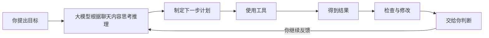


---

## 这份手册怎么读

你不需要懂代码，也不需要懂高等数学。

你可以先抓住几个生活类比：

| AI 概念 | 可以先理解成 |
|---|---|
| 大模型 | Agent的大脑 |
| Agent | 大脑+工具组成的聪明助理 |
| 上下文窗口 | Agent当前聊天的所有记忆|
| 记忆系统 | 助理长期保存的一些偏好、资料或经验 |
| 工具 | 助理可以调用的各种能力，例如查网页、算表格、改文件 |
| MCP | 给 agent 接更多工具和资料的一种方法 |
| CLI | 操作电脑的一种方式 |
| Skills | 给 agent 看的一套“做某类事的标准流程和经验” |
---
看不懂也没事，让我们从第一章慢慢学起，全部学完后再回顾你对ai agent的架构会有更具体的认知

# 第一章：大模型是什么

## 1.1 先记住一句话

这一章只讲大模型本身，不讲 agent。

先用最简单的图理解：

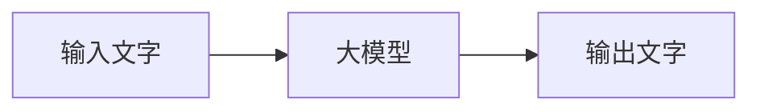

你输入一段文字，大模型根据这段文字继续生成文字。

比如：

```text
输入文字：请解释什么是大模型
大模型：根据输入进行预测
输出文字：大模型可以理解为……
```
你给进去文字，它根据前面的文字预测后面的文字

它不是人脑，不是全知全能。它的核心能力是：根据输入文字和上下文，预测接下来最可能出现、也最可能有用的文字。

## 1.2 借用“函数”来理解

你在初中数学里见过函数：

```text
y = 2x
```

如果输入 `x = 3`，输出就是：

```text
y = 2 * 3 = 6
```

这个函数很简单。你一眼就能看懂它在做什么。

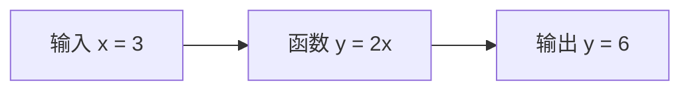

这里我们借用的只有一个想法：

```text
有输入，就会经过某个规则，得到输出。
```

大模型里的函数不是 `y = 2x` 这种一行公式，而是很多层计算接在一起，非常复杂。

为了让机器能处理文字，第一步会先把文字变成数字。你不需要知道具体怎么变，只要知道：电脑最终处理的是数字。

```text
输入文字
  -> 第1层计算：很多小旋钮一起起作用
  -> 第2层计算：继续加工
  -> 第3层、第4层、第5层……第n层
  -> 输出：下一个文字小片段最可能是什么
```

如果写成非常简化的样子，大概像这样：

```text
y = 第n层( ... 第3层( 第2层( 第1层(x) ) ) ... )
```

这里的“小旋钮”代表模型内部大量可以调整的权重。对于AI工程师和研究员们来说，训练大模型，就是让它看大量样本，然后不断调整这些小旋钮，让它越来越会预测下一个内容。

## 1.3 大模型里面有什么 （了解）

可以先抓住三个部分：

| 部分 | 通俗理解 |
|---|---|
| 输入 | 你给的文字和前面的上下文 |
| 很多层神经网络 | 用训练得到的权重处理输入 |
| 输出 | 对下一个文字的预测结果 |

这些层共同决定：看到某段文字时，模型更可能接着生成什么。

## 1.4 大模型怎么训练：反复猜，反复改（了解）

训练时，系统会反复做类似这样的事情：

```text
给模型看一段内容
遮住后面一部分
让模型猜后面是什么
猜错了，就调整内部参数
再猜
再调整
重复很多很多次
```

比如：

```text
输入：小明今天去上学时忘了带____
正确答案可能是：作业、雨伞、电脑
模型一开始可能猜错
训练会让它以后更容易猜对类似内容
```

它不是背下每一个答案，而是在大量例子里学到“什么内容后面更可能接什么”。

## 1.5 为什么连训练模型的人也无法完全理解它（了解）

简单函数 `y = 2x`，人能完全看懂。

大模型不一样。它不是一张人类能逐条阅读的规则表。

它有非常多参数，这些参数一起工作。最后模型能生成很像样的内容，但很难说清楚：

```text
为什么这个参数正好是这个数？
为什么这一层这样配合那一层？
为什么这个词后面更容易生成那个词？
```

训练完的模型是一个复杂的黑盒。我们能通过输出结果判断它在很多情况下表现如何，但很难解释“第 872341 个旋钮为什么正好是这个数”。

所以：

> 大模型是人训练出来的，但不是人能逐条读懂的规则书。

在看不懂“大模型为什么这样思考”这点上，专业的AI工程师和普通用户是一样的

## 1.6 大模型生成内容的本质：不断猜下一个

大模型回答问题时，不是一次性把整篇答案从脑子里拿出来。


它更像这样一步一步生成：

```text
看到前文 -> 猜下一个字/词
把猜出来的内容接到后面 -> 再猜下一个
再接上 -> 再猜下一个
一直重复
```


例子：

```text
输入：今天天气很
可能的下一个词：
晴朗：60%
热：20%
冷：8%
糟糕：5%
其他：7%
```

模型会根据概率选择一个，然后继续往下猜。

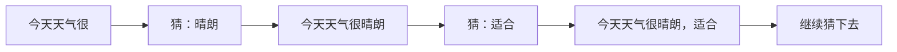

所以，大模型推理生成的本质就是：

> 根据已经看到的内容，不断猜下一个最可能有用的内容。

## 1.7 这里的“猜”不是乱猜

听到“猜”，你可能会觉得它很不靠谱。

但大模型的猜，不是闭着眼乱猜。它是根据大量训练学到的规则、当前上下文和任务要求来猜。

你也可以把它理解为大模型的直觉

但再有根据的猜，也仍然可能错。

这就是为什么 AI 会出现：

- 看起来很像真的错误答案；
- 编造不存在的引用；
- 数字算错；
- 把相似概念混在一起；
- 对新消息不了解。

## 1.8 大模型不等于什么

| 容易误会 | 更准确的理解 |
|---|---|
| 它什么都知道 | 它只是在训练时学过的资料和当前聊天上下文基础上回答 |
| 它说得流畅就一定对 | 大模型永远在猜下一个最合适的字，它说的答案看起来总是头头是道非常流畅，但这不代表它的答案100%对 |
| 它会像人一样理解世界 | 它不理解这个世界，也不理解你在说什么，它只负责根据训练时学到的规则预测下一个最合理的文字作为回答 |
| 它能自动知道最新消息 | 如果没有联网或补充资料，它不知道。它的知识全部来自于训练过程学习的那些数据 |
| 它可以替你负责 | 最后判断和责任仍然在人 |

## 1.9 大模型为什么会犯错

大模型犯错很正常。对普通使用者来说，最常见的问题其实就三种：

```text
1. 上下文信息不全
2. 问的问题没有边界
3. 问题太大，推理链条太长
```

### 第一类：上下文信息不全

大模型回答问题时，只能根据它“看见”的内容来猜。

如果你没有把关键背景告诉它，它就会自己补全。补全得对，看起来就很聪明；补全错了，就会一本正经地胡说。

比如你问：

```text
帮我分析一下这个班学生为什么成绩下降。
```

但你没有告诉它：

- 是哪个年级；
- 哪一门课下降；
- 下降了多少；
- 是全班下降，还是少数人下降；
- 最近有没有换老师、换教材、考试变难、生病请假等情况。

这时大模型可能会回答：

```text
可能是学习动力不足、课堂注意力不集中、家长监督不够。
```

这些话听起来有道理，但不一定是真的。因为它没有看到真实材料，只是在根据常见情况猜。

更好的问法是：

```text
这是初二数学最近三次考试的平均分：
第一次 82 分，第二次 76 分，第三次 71 分。
最近换了新老师，考试题也变难了。
请帮我分析可能原因，并把“确定事实”和“可能猜测”分开写。
```

记住：

> 你不给全背景信息，大模型就只能自己猜背景。

### 第二类：问题没有边界

有些问题不是上下文信息不够，而是问题本身太宽泛、太空、没有限制。

比如：

```text
帮我做一个很好的活动方案。
```

这个问题完全没有收敛边界。大模型不知道干到什么地步才称得上“很好的活动方案”：

- 活动给谁参加；
- 预算是多少；
- 场地要在哪里；
- 活动多长时间；
- 目标是招生、宣传、团建，还是卖货；
- 你想要正式风格，还是轻松风格；
- 哪些事情不能做。

所以它只能给你一份“看起来像活动方案”的通用答案。

这种答案最大的问题是：不一定错，但很可能没用。

更好的问法是：

```text
我要给 10 名无技术背景的学员办一场 2 小时 AI 入门体验课。
预算 1000 元以内，地点在社区教室。
目标是让他们敢于使用 Claude，不讲代码。
请设计活动流程，要求有一次互动练习。
```

这样，大模型就知道边界在哪里。

边界包括：

- 给谁；
- 做什么；
- 多久；
- 预算多少；
- 输出什么格式；
- 不能做什么；
- 用什么风格；
- 什么算完成。

记住：

> 问题没有边界，大模型就会给你一份“万能但空泛”的答案。

### 第三类：问题实在太复杂

大模型能轻松完成一步、两步、三步的任务。

但如果你一次让它做太多事，它就容易中途跑偏。

比如你说：

```text
请直接解一道很复杂的数学题，并给出最终答案。
```

这个任务看起来只是一个问题，但里面可能包含很多步：

```text
读懂题目 -> 找条件 -> 判断用什么方法 -> 列式子 -> 第一步计算 -> 第二步计算 -> 第三步计算 -> 检查答案
```

大模型每一步都在根据前面的内容继续猜。前面某一步猜错了，后面就会跟着错。

这就像走楼梯：

```text
第一步踩歪了，后面每一步都可能越来越偏。
```


更好的方式是拆开问：

```text
第一步：请先把题目里的已知条件列出来。
```

等它回答后，再继续：

```text
第二步：请说明这道题应该先算什么、后算什么。
```

再继续：

```text
第三步：请只计算第一步，并解释为什么这样算。
```

最后再说：

```text
请继续下一步。每算完一步，都先检查有没有算错。
```

这样每一步都短，你也能检查。

记住：

> 长链路的复杂任务要拆小，AI才能高质量的交付。

### 一个简单检查口诀

如果你发现 AI 的回答不对，先问自己三件事：

```text
我有没有给足背景？
我有没有说清边界？
我是不是一次问的问题太大？
```

很多时候，不是 AI “突然变笨”，而是任务交代得不够适合它处理。

## 1.10 信任边界：什么时候要特别小心

遇到下面这些内容，不要完全相信 AI 的答案：

- 医疗建议；
- 法律判断；
- 金融投资；
- 合同条款；
- 学术引用；
- 涉及钱、健康、安全、法律责任的决定。

> 前面我们说了，大模型回答问题的本质是猜下一个字，即使现代Agent有了联网查询信息的能力，回答仍可能存在不实信息。
如果你的问题要求绝对不能犯错，那最好别完全信任AI给出的答案

## 1.11 本章自测

学完第一章后，先不要急着进入下一章。请试着回答下面几个问题。

不要求背原文。只要你能用自己的话说清楚，就说明你基本理解了。


### 自测 1：为什么说大模型不是全知全能的神？


你可以这样理解：

```text
大模型是在根据前面的文字猜（推理）后面的文字。它通过大量训练学习来掌握猜字推理的规则
它大概率能说对，但也可能说错。
```

### 自测 2：大模型常见犯错原因有哪三类？

请补全：

```text
1. 上下文信息不____
2. 问的问题没有____
3. 问题太____，推理链条太长
```

答案：

```text
1. 上下文信息不全
2. 问的问题没有边界
3. 问题太复杂，推理链条太长
```

### 自测 3：下面这个提示词为什么不好？

```text
帮我做一个很好的方案。
```

你应该能看出：

```text
它没有说清楚给谁做、做什么、预算多少、输出什么、什么算好。
这个问题没有边界。
```
---

# 第二章：Agent 是什么

## 2.1 先记住一句话

Agent 是一个“会围绕目标持续行动的 AI 助理”。


普通聊天更像问答：

```text
你问一句 -> AI 答一句
```

Agent 更像做任务：

```text
你给目标 -> AI 拆步骤 -> AI 用工具 -> AI 产出结果 -> AI 检查 -> 你反馈 -> AI 修改
```

## 2.2 一个生活比喻

如果大模型本身只负责“根据输入文字生成输出文字”，agent 就像“把大模型和工具箱组织起来做事的助理”。

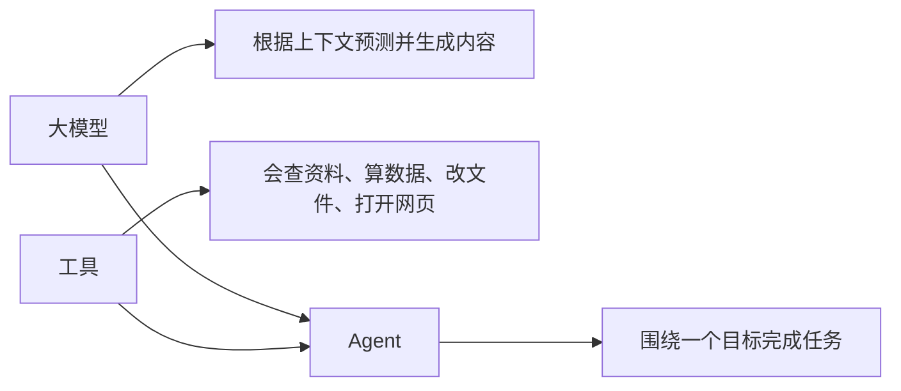

## 2.3 Agent 的基本工作循环

一个典型 agent 做事时，常常会经历这些步骤：

| 步骤 | 它在做什么 | 你应该关注什么 |
|---|---|---|
| 1. 理解目标 | 看你到底要什么 | 目标是否清楚 |
| 2. 收集上下文 | 读取你给的材料 | 材料是否完整 |
| 3. 制定计划 | 先做什么，后做什么 | 步骤是否合理 |
| 4. 调用工具 | 用表格、浏览器、文件、命令等工具 | 工具是否适合 |
| 5. 生成结果 | 产出报告、页面、方案、表格等 | 输出是否符合要求 |
| 6. 检查问题 | 找错误、跑测试、核对格式 | 是否真的检查过 |
| 7. 接受反馈 | 根据你的意见继续改 | 反馈是否具体 |

## 2.4 Agent 和普通 AI 聊天的区别

| 对比点 | 普通聊天 | Agent |
|---|---|---|
| 主要形式 | 问答 | 做任务 |
| 行动能力 | 多数只回答 | 可以调用工具 |
| 时间长度 | 通常一问一答 | 可以多轮推进 |
| 产物 | 文字较多 | 文件、报告、网页、表格、代码、计划等 |
| 重点 | 答案 | 过程和结果 |
| 风险 | 答错 | 做错、改错文件、误用资料、过度自动化 |

## 2.5 Agent 的能力边界

Agent 比普通聊天更能做事，所以也更需要边界。

它常见的边界包括：

| 边界 | 通俗解释 |
|---|---|
| 目标边界 | 目标不清楚，它会猜 |
| 上下文边界 | 没给资料，它无法凭空知道 |
| 工具边界 | 没有工具，它就做不了外部动作 |
| 权限边界 | 没有授权，它不能访问某些文件或账号 |
| 时间边界 | 长任务可能中断或偏离 |
| 成本边界 | 大量运行、搜索、生成会消耗资源 |
| 责任边界 | 它能建议，但最终负责的是人 |

## 2.6 使用 agent 的好习惯

每次开始任务前，尽量说清楚：

```text
我要完成什么？
给谁看？
我已经有什么材料？
希望输出成什么样？
哪些事情不要做？
完成后怎么检查？
```

这叫“任务说明”。任务说明越清楚，agent 越像好助理；任务说明越模糊，agent 越像在猜谜。

---

# 第三章：上下文窗口与记忆系统

## 3.1 先记住一句话

上下文窗口是 agent “此刻能看到的桌面”；记忆系统是 agent “可能长期记住的小笔记本”。


二者不是一回事。

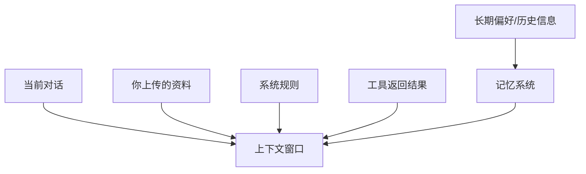

## 3.2 什么是上下文窗口

你可以把上下文窗口想成一张桌子。

桌子上放着：

- 你刚说的话；
- 之前对话中的重要内容；
- 上传的文件片段；
- 系统给 agent 的规则；
- 工具刚刚返回的结果；
- agent 自己刚写出的计划或草稿。

Agent 回答时，主要看这张“桌子”上的内容。

## 3.3 上下文窗口有什么限制

桌子再大，也不是无限大。

如果资料太多，agent 可能：

- 忘记早先的细节；
- 只看到部分文件；
- 把多个要求混在一起；
- 错过你很久以前说过的限制；
- 需要压缩或总结旧内容。

所以你要学会把重要信息重新说清楚。

例如：

> “请继续按前面说的要求做，特别注意：目标读者是初中基础学生，不要使用技术术语。”

## 3.4 什么是记忆系统

记忆系统可以保存一些长期有用的信息，例如：

- 你喜欢简洁风格；
- 你常用中文；
- 你所在课程的背景；
- 某个项目长期规则；
- 你反复强调的偏好。

但记忆系统不是万能硬盘。它可能没有开启，也可能只保存少量内容，还可能受产品设置、隐私规则和权限影响。

## 3.5 上下文和记忆的区别

| 对比 | 上下文窗口 | 记忆系统 |
|---|---|---|
| 像什么 | 当前桌面 | 长期笔记本 |
| 保存时间 | 当前任务或对话中 | 可能跨对话保存 |
| 内容来源 | 对话、文件、工具结果 | 用户偏好、长期信息 |
| 是否完整 | 不一定 | 更不一定 |
| 使用建议 | 重要要求重复写清楚 | 不要依赖它记住所有事 |

## 3.6 给学生的简单规则

不要说：

> “你还记得吧？”

更好说：

> “继续这个任务。请记住三个要求：第一，语言通俗；第二，不写代码；第三，每章都有例子。”

AI 不是人类同桌。你越清楚，它越可靠。

---

# 第四章：工具扩展：MCP、CLI 与外部能力

## 4.1 先记住一句话

大模型本身主要会“想和说”；工具让 agent 能“查、算、改、连、做”。

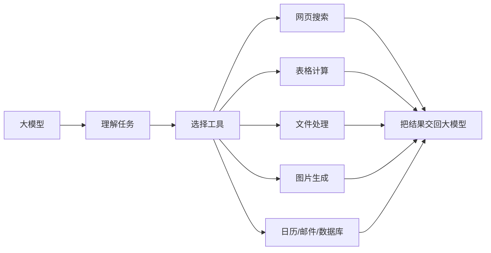

## 4.2 为什么需要工具

如果没有工具，agent 很多时候只能“根据已知内容回答”。

有了工具，它可以：

- 打开文件；
- 读取表格；
- 生成图表；
- 查询网页；
- 调用日历；
- 运行检查；
- 生成图片；
- 修改文档；
- 创建网页原型；
- 连接企业系统。

这就是 agent 比普通聊天更像“做事系统”的原因。

## 4.3 什么是 MCP

MCP 可以先理解成一种“标准插座”。


不同工具原本像不同形状的插头。MCP 的作用，是让 agent 用比较统一的方式连接这些工具和资料。

```text
没有标准插座时：

Agent --?-- 工具A
Agent --?-- 工具B
Agent --?-- 工具C

有 MCP 之后：

Agent -- MCP -- 工具A
             -- 工具B
             -- 工具C
```

更生活化一点：

| 概念 | 类比 |
|---|---|
| Agent | 一个想完成任务的助理 |
| MCP | 万能转接头 |
| 外部工具 | 计算器、资料柜、网页、日历、数据库 |
| 授权 | 你允许助理打开哪个柜子 |

## 4.4 MCP 能扩展什么能力

MCP 常用于让 agent 连接：

- 文档系统；
- 表格系统；
- 网页浏览器；
- 数据库；
- GitHub 等项目平台；
- 日历、邮件、消息工具；
- 企业内部知识库；
- 自定义工具。

注意：连接不代表可以随便用。通常还需要权限、账号授权和安全规则。

## 4.5 什么是 CLI

CLI 可以理解为“用文字命令操作电脑”。

平常我们点按钮：

```text
打开软件 -> 点击菜单 -> 选择功能
```

CLI 则是输入文字命令：

```text
请电脑执行某个操作
```

对学生来说，不需要学会写命令。只需要知道：有些 agent 可以通过 CLI 让电脑执行更精确的操作，例如处理文件、运行检查、启动本地网页、转换格式。

## 4.6 CLI 和普通按钮有什么区别

| 普通按钮 | CLI |
|---|---|
| 对人更直观 | 对机器更直接 |
| 适合简单操作 | 适合重复、批量、自动化操作 |
| 你看到界面 | 你看到文字输出 |
| 容易点错但影响较小 | 命令写错可能影响大 |

所以 agent 使用 CLI 时，特别需要限制权限和确认动作。

## 4.7 工具扩展的风险

工具让 agent 更强，也让风险变大。

| 风险 | 例子 | 应对方式 |
|---|---|---|
| 误操作 | 改错文件 | 先备份，查看变更 |
| 权限过大 | 访问不该看的资料 | 最小授权 |
| 资料泄露 | 上传隐私数据 | 脱敏处理 |
| 工具结果错误 | 网页信息过时 | 找可靠来源交叉确认 |
| 自动化失控 | 定时重复执行错误任务 | 设置停止条件和通知 |

记住：

> 工具越强，越要有边界。

---

# 第五章：Skills：给 Agent 看的标准与经验

## 5.1 先记住一句话

Skill 就像给 agent 的“工作说明书”。

人做事有经验：

> “做海报时先确定受众，再定风格，再排版，再检查文字。”

Agent 也可以参考类似经验。Skills 就是把这类经验写成可重复使用的流程。

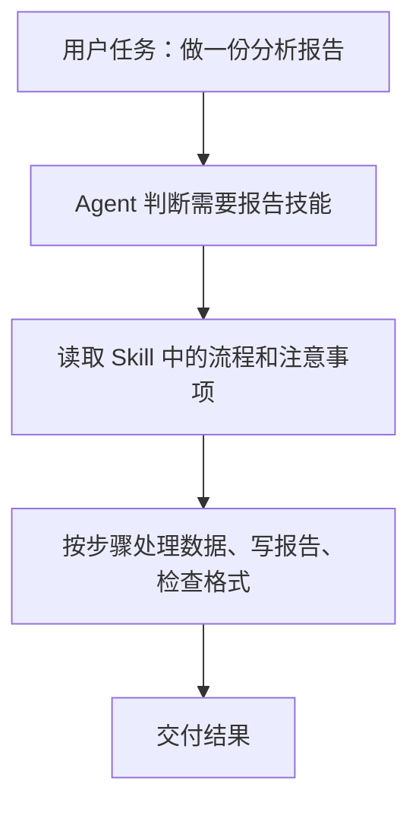

## 5.2 Skill 里通常有什么

一个 skill 可能包含：

- 这类任务的目标；
- 操作步骤；
- 质量标准；
- 常见错误；
- 推荐工具；
- 示例模板；
- 检查清单；
- 输出格式。

## 5.3 为什么 skill 很重要

如果没有 skill，agent 可能每次都临时想办法。

有了 skill，agent 更容易：

- 按稳定流程做事；
- 少漏步骤；
- 采用专业经验；
- 保持输出风格一致；
- 在复杂任务中知道先后顺序。

## 5.4 一个简单例子

假设有一个“数据分析报告 skill”，它可能告诉 agent：

```text
1. 先看数据字段。
2. 再检查缺失值和异常值。
3. 再做基础统计。
4. 再画图。
5. 最后写结论。
6. 结论必须说明依据，不能夸大。
```

这对没有经验的人也有帮助，因为你可以要求 agent：

> “请按数据分析报告的标准流程做，并在最后列出你检查过哪些问题。”

## 5.5 Skill 不等于保证正确

Skill 是经验，不是魔法。

它能帮助 agent 更规范，但仍然可能：

- 理解错任务；
- 使用错资料；
- 漏掉特殊情况；
- 生成错误结论；
- 需要人类检查。

所以 skill 最适合作为“标准流程”，不适合作为“最终裁判”。

---

# 第六章：定时任务

## 6.1 先记住一句话

定时任务就是让 agent 在指定时间自动提醒、检查或继续做事。

生活类比：

| 普通闹钟 | Agent 定时任务 |
|---|---|
| 到点响一下 | 到点可以做一件事 |
| 只提醒你 | 可以提醒、检查、整理、汇报 |
| 内容简单 | 可以带上下文和任务说明 |

## 6.2 定时任务能做什么

常见用途：

- 明天早上提醒我复习；
- 每周一整理一次学习计划；
- 每天检查某个数据是否更新；
- 到截止日期前提醒我提交作业；
- 每隔一段时间查看某个网页或文件变化；
- 在项目结束后生成复盘报告。

## 6.3 定时任务的工作图

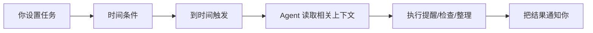

## 6.4 设置定时任务时要说清楚什么

一个好的定时任务应该包含：

```text
什么时候做？
做什么？
需要看哪些资料？
完成后告诉我什么？
如果失败怎么办？
什么时候停止？
```

不够好的说法：

> “以后提醒我学习。”

更好的说法：

> “从明天开始，每天晚上 8 点提醒我复习 AI agent 课程。提醒内容包括：复习 20 分钟、完成一题练习、写一句今天学到的内容。连续提醒 7 天后停止。”

## 6.5 定时任务的边界

定时任务不是万能管家。

要注意：

- 它可能依赖平台是否支持；
- 它可能需要权限；
- 它可能需要网络或文件可访问；
- 它不能替你完成所有长期责任；
- 设置太多会变成噪音；
- 高风险自动操作要谨慎。

最安全的做法：

> 先让 agent “提醒和汇报”，不要一开始就让它自动做不可逆操作。

---

# 第七章：你可能遗漏的 Agent 核心设计

除了大模型、工具、上下文、记忆、skills 和定时任务，现代 agent 还有一些非常重要的设计。

## 7.1 目标与任务说明

Agent 最怕目标模糊。

模糊目标：

> “帮我做一个厉害的内容。”

清楚目标：

> “帮我为小红书写 3 个关于 AI 学习方法的选题。目标读者是大学新生。语气轻松，不制造焦虑。每个选题包括标题、核心观点、开头 3 秒文案和可能的风险点。”

你可以用这个模板：

```text
我要完成的任务：
给谁看：
已有材料：
希望输出格式：
语言风格：
限制条件：
必须检查：
不要做的事：
```

## 7.2 计划与分步执行

大任务要拆小。

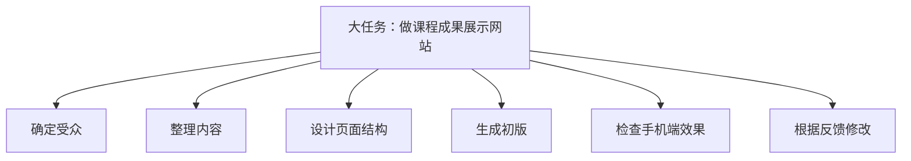

不要一次要求：

> “帮我调研、分析、设计、写作、做网站、检查并发布。”

更好：

1. 先让它列计划；
2. 你确认计划；
3. 再让它做第一步；
4. 每一步检查后继续。

## 7.3 工具选择

Agent 不应该什么都靠想。

| 任务 | 更适合的方式 |
|---|---|
| 最新新闻 | 联网搜索并看来源 |
| 大量数据计算 | 表格或数据工具 |
| 文档排版 | 文档工具 |
| 网页体验 | 浏览器检查 |
| 复杂事实 | 多来源核对 |
| 个人偏好 | 问你或读取你提供的说明 |

你可以直接要求：

> “如果需要最新资料，请先搜索并给出来源。”

或：

> “请不要凭记忆回答，先根据我上传的文件总结。”

## 7.4 权限与审批

Agent 做事需要权限。

你可以把权限想成“钥匙”。

```text
没有钥匙：只能看你给的内容
普通钥匙：可以读某个文件夹
高级钥匙：可以修改文件、访问账号、运行操作
```

不要随便给高级钥匙。

基本原则：

- 只给完成任务需要的最小权限；
- 重要文件先备份；
- 涉及删除、覆盖、发送、付款等动作，要人工确认；
- 不把密码、验证码、身份证、银行卡等敏感信息交给 AI。

## 7.5 观察与反馈

好的 agent 系统会让你看到过程，而不是只看到结果。

你应该观察：

- 它读了哪些资料；
- 它做了哪些假设；
- 它用了哪些工具；
- 它生成了哪些文件；
- 它检查了哪些内容；
- 它还有哪些不确定。

反馈时不要只说：

> “不行，重做。”

更好说：

> “第二段太难懂，请改成初中生能懂的语言；表格保留，但每个概念后面加一个生活例子；不要使用专业缩写。”

## 7.6 验证与评估

验证就是问：

> “这个结果凭什么可信？”

常见验证方法：

| 产出 | 可以怎样检查 |
|---|---|
| 数据结论 | 看原始数据、公式、图表是否对应 |
| 文章 | 查事实、查引用、看是否跑题 |
| 应用页面 | 打开试用，看按钮能不能点 |
| 计划 | 看时间是否现实、步骤是否完整 |
| 翻译 | 对照原文，看是否漏意思 |
| 总结 | 对照原文，看是否编造 |

记住：

> 没有验证的 AI 结果，只能叫草稿。

## 7.7 人在回路中

“人在回路中”意思是：关键步骤由人确认。

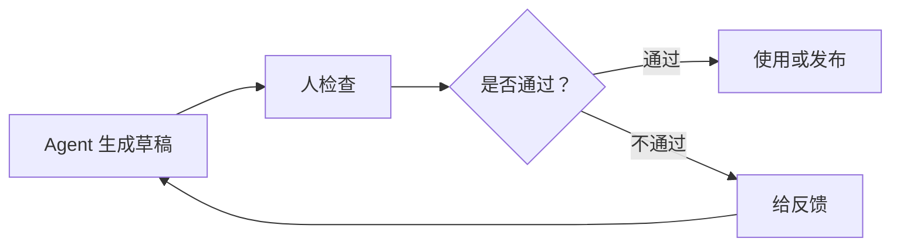

适合让人确认的地方：

- 发布前；
- 发邮件前；
- 删除文件前；
- 使用个人资料前；
- 做重要决定前；
- 给出结论前。

## 7.8 多 Agent 协作

有些系统可以让多个 agent 分工。

生活类比：一个小组做项目。

| 角色 | 可能负责 |
|---|---|
| 资料员 | 查资料 |
| 分析员 | 做数据分析 |
| 编辑 | 改文字 |
| 检查员 | 找错误 |
| 项目经理 | 汇总结果 |

多 agent 的好处：

- 可以并行做事；
- 每个 agent 专注一个任务；
- 可以互相检查。

多 agent 的风险：

- 信息传递可能丢失；
- 多个结果可能互相矛盾；
- 成本更高；
- 更需要人来统一判断。

## 7.9 成本、速度与质量

AI 做事也有成本。

这里的成本不只指钱，还包括：

- 等待时间；
- 计算资源；
- 人工检查时间；
- 出错后的返工；
- 隐私和安全风险。

简单规律：

| 想要 | 通常需要 |
|---|---|
| 更快 | 接受更粗略结果 |
| 更准确 | 给更多资料和检查 |
| 更自动 | 设置更多边界 |
| 更专业 | 提供标准和样例 |

## 7.10 日志与可追溯

可追溯就是事后能说清：

```text
用了什么资料？
做了哪些步骤？
改了什么内容？
为什么得出这个结论？
谁批准了最终结果？
```

对学习和工作都很重要。

如果 AI 帮你做了报告，你至少应该能回答：

- 数据来自哪里；
- AI 做了哪些处理；
- 哪些结论是数据支持的；
- 哪些只是建议；
- 你自己检查了什么。

---

# 第八章：AI Agent 的安全使用

## 8.1 先记住一句话

不要因为 AI 说得像真的，就把它当成真的。

## 8.2 五个安全问题

每次使用 agent 前，问自己五个问题：

1. 我是否给了不该给的隐私？
2. 这个任务出错会不会造成严重后果？
3. AI 的结论有没有来源？
4. 我是否看过最终结果？
5. 有没有人需要为这个结果负责？

## 8.3 不要上传的内容

一般不要随便上传：

- 身份证号；
- 银行卡号；
- 密码；
- 验证码；
- 私人聊天记录；
- 未授权的照片；
- 未公开的公司资料；
- 病历；
- 成绩单；
- 合同原件；
- 其他人的隐私信息。

如果教学必须使用真实材料，应先脱敏。

脱敏就是把敏感内容替换掉。

例如：

```text
张三，手机号 138xxxx8888，消费 36 元
```

可以改成：

```text
学生A，手机号已隐藏，消费 36 元
```

## 8.4 防止 AI 编造

你可以这样要求 agent：

```text
请把事实、推测和建议分开写。
如果没有依据，请明确说“不确定”。
不要编造来源。
涉及数据的结论，请指出来自哪一列或哪一段资料。
```

## 8.5 发布前检查清单

发布任何 AI 辅助内容前，检查：

- 标题是否夸张；
- 数据是否准确；
- 引用是否真实；
- 是否侵犯他人版权；
- 是否泄露隐私；
- 是否有歧视或伤害性表达；
- 是否把建议说成事实；
- 是否需要注明 AI 辅助。

---

# 第九章：三个完整例子

## 9.1 例子一：数据分析

任务：

> 分析一份班级问卷，了解同学们使用 AI 工具的习惯。

好的任务说明：

```text
请根据我上传的问卷数据，分析同学们使用 AI 工具的频率、主要用途和最大担忧。
请输出：
1. 三个主要发现；
2. 两张适合放进汇报的图表；
3. 一段 200 字总结；
4. 数据中可能不可靠的地方。
不要夸大结论，因为样本只来自一个班。
```

检查重点：

- 样本人数是多少；
- 有没有空白答案；
- 图表和原数据是否一致；
- 结论有没有超过数据范围。

## 9.2 例子二：自媒体创作

任务：

> 为“大学生如何使用 AI agent 学习”做一周内容计划。

好的任务说明：

```text
请为小红书账号设计 7 天内容计划。
目标读者是刚接触 AI 的大学生。
风格要轻松、真实、不制造焦虑。
每一天包括：标题、核心观点、开头文案、正文要点、互动问题。
请避免夸大 AI 能力，也不要暗示 AI 可以代替学习。
```

检查重点：

- 标题是否误导；
- 是否有事实错误；
- 是否适合目标读者；
- 是否过度承诺；
- 是否有原创表达。

## 9.3 例子三：简单应用原型

任务：

> 做一个课程成果展示页面。

好的任务说明：

```text
请帮我做一个简单的课程成果展示网页原型。
页面给老师和同学看。
内容包括：课程介绍、三个小组作品、每个作品的截图位置、学习收获、反馈入口。
风格清爽，手机上也要能看。
先给页面结构，再生成初版。
完成后请检查有没有文字重叠、按钮不明显、手机端太挤的问题。
```

检查重点：

- 页面是否能打开；
- 手机上是否能看；
- 文字是否清楚；
- 按钮是否明显；
- 是否符合课程主题。

---

# 第十章：给学生的常用提示模板

## 10.1 通用任务模板

```text
我的目标是：
目标读者/使用者是：
我提供的材料有：
请你帮我完成：
输出格式要求：
语言风格：
限制条件：
请特别检查：
如果不确定，请先问我或标出来。
```

## 10.2 让 AI 更通俗

```text
请用初中生能听懂的语言解释。
每个概念先用一句话说明，再举一个生活例子。
不要使用专业缩写；如果必须使用，请先解释。
```

## 10.3 让 AI 不乱编

```text
请只根据我提供的资料回答。
如果资料中没有，请写“资料中没有说明”。
不要编造数字、来源、人物或案例。
```

## 10.4 让 AI 做检查

```text
完成后请自查：
1. 是否符合任务目标；
2. 是否遗漏要求；
3. 是否有事实不确定；
4. 是否需要人工确认；
5. 下一步建议是什么。
```

## 10.5 让 AI 分步骤

```text
请先不要直接完成。
先列出你准备怎么做，分成 3 到 5 步。
等我确认后，再执行第一步。
```

---

# 第十一章：一页速记表

## 11.1 大模型

一句话：

> 会理解和生成内容的语言系统。

能做：

- 总结；
- 改写；
- 翻译；
- 写作；
- 解释；
- 规划；
- 分类。

不能保证：

- 永远正确；
- 知道最新；
- 自动有来源；
- 替你负责。

## 11.2 Agent

一句话：

> 带目标、会用工具、能多步完成任务的 AI 助理。

关键组成：

- 大模型；
- 上下文；
- 工具；
- 计划；
- 记忆；
- skills；
- 权限；
- 检查；
- 人类反馈。

## 11.3 使用口诀

```text
说清目标
给足资料
拆小步骤
限制边界
要求来源
检查结果
谨慎发布
人来负责
```

## 11.4 最重要的一句话

> AI agent 可以帮你更快开始、更好整理、更容易产出，但不能替你思考、判断和负责。

---

# 第十二章：课后思考题

1. 为什么说“AI 说得流畅”不等于“AI 说得正确”？
2. Agent 和普通聊天机器人最大的区别是什么？
3. 如果让 agent 分析一份问卷，你至少要给它哪些信息？
4. 为什么上下文窗口不是无限的？
5. MCP 为什么可以理解成“标准插座”？
6. Skill 为什么像“工作说明书”？
7. 定时任务适合做什么，不适合做什么？
8. 你会怎样检查一篇 AI 写的自媒体文案？
9. 哪些资料不应该随便上传给 AI？
10. 请写一份你自己的 AI agent 使用守则。

---

# 附录 A：小词典

| 词 | 通俗解释 |
|---|---|
| AI | 人工智能，让机器表现出某些“像智能”的能力 |
| 大模型 | 输入输出模型，接收上下文，预测并生成输出 |
| Prompt | 你给 AI 的任务说明或问题 |
| Agent | 能围绕目标行动的 AI 助理 |
| 上下文 | AI 当前能看到的相关信息 |
| 上下文窗口 | AI 当前能放下多少信息的范围 |
| 记忆 | AI 可能长期保存的偏好或资料 |
| 工具 | AI 可以调用的外部能力 |
| MCP | 连接 agent 和外部工具的标准方式之一 |
| CLI | 用文字命令操作电脑的方式 |
| Skill | 给 agent 参考的任务流程和经验 |
| 自动化 | 让任务按条件或时间自动发生 |
| 人在回路中 | 关键步骤由人检查和批准 |
| 幻觉 | AI 编出看似合理但不真实的内容 |
| 验证 | 检查结果是否可靠 |
| 脱敏 | 隐藏个人隐私或敏感信息 |

---

# 附录 B：教师可带学生画的黑板图

## 图 1：大模型与 agent

```text
大模型：根据输入文字和上下文，不断预测下一个文字

Agent：大模型 + 工具 + 目标 + 反馈

所以：
大模型负责生成文字
工具像手脚
上下文像桌面资料
记忆像笔记本
人类像最终负责人
```

## 图 2：可靠使用流程

```text
1. 给目标
2. 给资料
3. 让 AI 列计划
4. 人确认
5. AI 执行
6. AI 自查
7. 人复查
8. 修改后再使用
```

## 图 3：风险等级

```text
低风险：改写文案、整理笔记、头脑风暴
中风险：数据分析、公开发布、学术报告
高风险：医疗、法律、金融、隐私、合同

风险越高，越需要人工复核和专业确认。
```

---

# 附录 C：延伸阅读

以下资料适合教师备课或感兴趣的同学进一步了解。学生第一次阅读时，不必追求全部看懂。

- OpenAI Codex IDE extension: https://developers.openai.com/codex/ide
- OpenAI Codex cloud / web: https://developers.openai.com/codex/cloud
- OpenAI Codex skills: https://developers.openai.com/codex/skills
- OpenAI Codex subagents: https://developers.openai.com/codex/subagents
- OpenAI Codex prompting: https://developers.openai.com/codex/prompting
- OpenAI Codex best practices: https://developers.openai.com/codex/learn/best-practices
- OpenAI Codex sandboxing: https://developers.openai.com/codex/concepts/sandboxing
- OpenAI API code generation guide: https://developers.openai.com/api/docs/guides/code-generation
