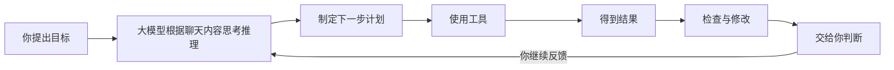
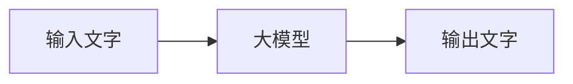
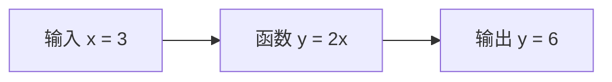
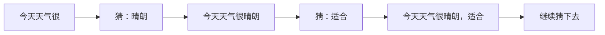
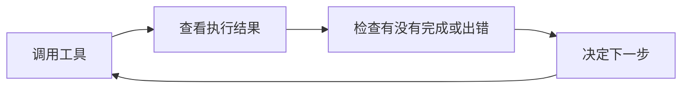
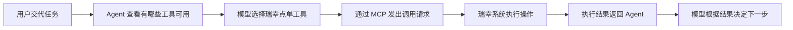
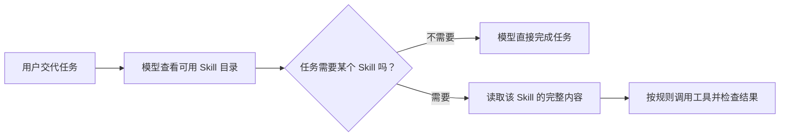
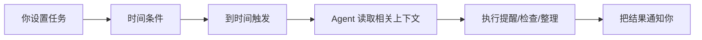
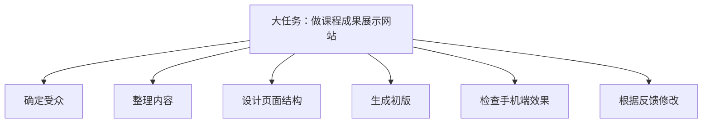
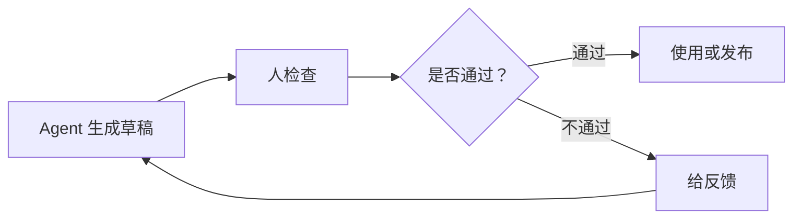

# 现代 AI Agent 学习导论

给零技术背景学生的课后参考手册

版本日期：2026-07-04  
适合对象：没有编程基础、刚开始学习 AI 工具的同学  
阅读目标：看完后，你能用通俗语言解释大模型和 AI agent 是什么，知道它们能做什么、不能做什么，也知道怎样更安全、更有效地使用它们。

---

## 一张概念图

AI agent 不是魔法师，是一个会使用工具的助理。




---

## 这份手册怎么读

你不需要懂代码，也不需要懂高等数学。

你可以先抓住几个生活类比：

| AI 概念 | 可以先理解成 |
|---|---|
| 大模型 | Agent的大脑 |
| Agent | 模型、工具和 ReAct 循环组成的任务执行系统 |
| 上下文窗口 | 模型一次推理最多能够同时接收和生成多少内容 |
| 记忆系统 | 助理长期保存的一些偏好、资料或经验 |
| 工具 | 助理可以调用的各种能力，例如查网页、算表格、改文件 |
| MCP | 给 agent 接更多工具和资料的一种方法 |
| CLI | 操作电脑的一种方式 |
| Skills | 需要时交给 Agent 的可重复任务材料、规则和流程 |
---
看不懂也没事，让我们从第一章慢慢学起，全部学完后再回顾你对ai agent的架构会有更具体的认知

# 第一章：大模型是什么

## 1.1 先把大模型和 Agent 分开

这一章只讲大模型本身，不讲 agent。

先用最简单的图理解：



你输入一段文字，大模型根据这段文字继续生成文字。

比如：

```text
输入文字：请解释什么是大模型
大模型：根据输入进行预测
输出文字：大模型可以理解为……
```
你给进去文字，它根据前面的文字预测后面的文字

它不是人脑，不是全知全能。它的核心能力是：根据输入文字和上下文，预测接下来最可能出现、也最可能有用的文字。

## 1.2 借用“函数”来理解

你在初中数学里见过函数：

```text
y = 2x
```

如果输入 `x = 3`，输出就是：

```text
y = 2 * 3 = 6
```

这个函数很简单。你一眼就能看懂它在做什么。



这里我们借用的只有一个想法：

```text
有输入，就会经过某个规则，得到输出。
```

大模型里的函数不是 `y = 2x` 这种一行公式，而是很多层计算接在一起，非常复杂。

为了让机器能处理文字，第一步会先把文字变成数字。你不需要知道具体怎么变，只要知道：电脑最终处理的是数字。

```text
输入文字
  -> 第1层计算：很多小旋钮一起起作用
  -> 第2层计算：继续加工
  -> 第3层、第4层、第5层……第n层
  -> 输出：下一个文字小片段最可能是什么
```

如果写成非常简化的样子，大概像这样：

```text
y = 第n层( ... 第3层( 第2层( 第1层(x) ) ) ... )
```

这里的“小旋钮”代表模型内部大量可以调整的权重。对于AI工程师和研究员们来说，训练大模型，就是让它看大量样本，然后不断调整这些小旋钮，让它越来越会预测下一个内容。

## 1.3 大模型里面有什么 （了解）

可以先抓住三个部分：

| 部分 | 通俗理解 |
|---|---|
| 输入 | 你给的文字和前面的上下文 |
| 很多层神经网络 | 用训练得到的权重处理输入 |
| 输出 | 对下一个文字的预测结果 |

这些层共同决定：看到某段文字时，模型更可能接着生成什么。

## 1.4 大模型怎么训练：反复猜，反复改（了解）

训练时，系统会反复做类似这样的事情：

```text
给模型看一段内容
遮住后面一部分
让模型猜后面是什么
猜错了，就调整内部参数
再猜
再调整
重复很多很多次
```

比如：

```text
输入：小明今天去上学时忘了带____
正确答案可能是：作业、雨伞、电脑
模型一开始可能猜错
训练会让它以后更容易猜对类似内容
```

它不是背下每一个答案，而是在大量例子里学到“什么内容后面更可能接什么”。

## 1.5 为什么连训练模型的人也无法完全理解它（了解）

简单函数 `y = 2x`，人能完全看懂。

大模型不一样。它不是一张人类能逐条阅读的规则表。

它有非常多参数，这些参数一起工作。最后模型能生成很像样的内容，但很难说清楚：

```text
为什么这个参数正好是这个数？
为什么这一层这样配合那一层？
为什么这个词后面更容易生成那个词？
```

训练完的模型是一个复杂的黑盒。我们能通过输出结果判断它在很多情况下表现如何，但很难解释“第 872341 个旋钮为什么正好是这个数”。

所以：

> 大模型是人训练出来的，但不是人能逐条读懂的规则书。

在看不懂“大模型为什么这样思考”这点上，AI工程师和普通用户是一样的

## 1.6 大模型生成内容的本质：不断猜下一个

大模型回答问题时，不是一次性把整篇答案从脑子里拿出来。

它更像这样一步一步生成：

```text
看到前文 -> 猜下一个字/词
把猜出来的内容接到后面 -> 再猜下一个
再接上 -> 再猜下一个
一直重复
```


例子：

```text
输入：今天天气很
可能的下一个词：
晴朗：60%
热：20%
冷：8%
糟糕：5%
其他：7%
```

模型会根据概率选择一个，然后继续往下猜。



所以，大模型推理生成的本质就是：

> 根据已经看到的内容，不断猜下一个最可能有用的内容。

## 1.7 这里的“猜”不是乱猜

听到“猜”，你可能会觉得它很不靠谱。

但大模型的猜，不是闭着眼乱猜。它是根据大量训练学到的规则、当前上下文和任务要求来猜。

你也可以把它理解为大模型的直觉

但再有根据的猜，也仍然可能错。

这就是为什么 AI 会出现：

- 看起来很像真的错误答案；
- 编造不存在的引用；
- 数字算错；
- 把相似概念混在一起；
- 对新消息不了解。

## 1.8 大模型不等于什么

| 容易误会 | 更准确的理解 |
|---|---|
| 它什么都知道 | 它只是在训练时学过的资料和当前聊天上下文基础上回答 |
| 它说得流畅就一定对 | 大模型永远在猜下一个最合适的字，它说的答案看起来总是头头是道非常流畅，但这不代表它的答案100%对 |
| 它会像人一样理解世界 | 它不理解这个世界，也不理解你在说什么，它只负责根据训练时学到的规则预测下一个最合理的文字作为回答 |
| 它能自动知道最新消息 | 如果没有联网或补充资料，它不知道。它的知识全部来自于训练过程学习的那些数据 |
| 它可以替你负责 | 最后判断和责任仍然在人 |

## 1.9 大模型为什么会犯错

大模型犯错很正常。对普通使用者来说，最常见的问题其实就三种：

```text
1. 上下文信息不全
2. 问的问题没有边界
3. 问题太大，推理链条太长
```

### 第一类：上下文信息不全

大模型回答问题时，只能根据它“看见”的内容来猜。

如果你没有把关键背景告诉它，它就会自己补全。补全得对，看起来就很聪明；补全错了，就会一本正经地胡说。

比如你问：

```text
帮我分析一下这个班学生为什么成绩下降。
```

但你没有告诉它：

- 是哪个年级；
- 哪一门课下降；
- 下降了多少；
- 是全班下降，还是少数人下降；
- 最近有没有换老师、换教材、考试变难、生病请假等情况。

这时大模型可能会回答：

```text
可能是学习动力不足、课堂注意力不集中、家长监督不够。
```

这些话听起来有道理，但不一定是真的。因为它没有看到真实材料，只是在根据常见情况猜。

更好的问法是：

```text
这是初二数学最近三次考试的平均分：
第一次 82 分，第二次 76 分，第三次 71 分。
最近换了新老师，考试题也变难了。
请帮我分析可能原因，并把“确定事实”和“可能猜测”分开写。
```

记住：

> 你不给全背景信息，大模型就只能自己猜背景。

### 第二类：问题没有边界

有些问题不是上下文信息不够，而是问题本身太宽泛、太空、没有限制。

比如：

```text
帮我做一个很好的活动方案。
```

这个问题完全没有收敛边界。大模型不知道干到什么地步才称得上“很好的活动方案”：

- 活动给谁参加；
- 预算是多少；
- 场地要在哪里；
- 活动多长时间；
- 目标是招生、宣传、团建，还是卖货；
- 你想要正式风格，还是轻松风格；
- 哪些事情不能做。

所以它只能给你一份“看起来像活动方案”的通用答案。

这种答案最大的问题是：不一定错，但很可能没用。

更好的问法是：

```text
我要给 10 名无技术背景的学员办一场 2 小时 AI 入门体验课。
预算 1000 元以内，地点在社区教室。
目标是让他们敢于使用 Claude，不讲代码。
请设计活动流程，要求有一次互动练习。
```

这样，大模型就知道边界在哪里。

边界包括：

- 给谁；
- 做什么；
- 多久；
- 预算多少；
- 输出什么格式；
- 不能做什么；
- 用什么风格；
- 什么算完成。

记住：

> 问题没有边界，大模型就会给你一份“万能但空泛”的答案。

### 第三类：问题实在太复杂

大模型能轻松完成一步、两步、三步的任务。

但如果你一次让它做太多事，它就容易中途跑偏。

比如你说：

```text
请直接解一道很复杂的数学题，并给出最终答案。
```

这个任务看起来只是一个问题，但里面可能包含很多步：

```text
读懂题目 -> 找条件 -> 判断用什么方法 -> 列式子 -> 第一步计算 -> 第二步计算 -> 第三步计算 -> 检查答案
```

大模型每一步都在根据前面的内容继续猜。前面某一步猜错了，后面就会跟着错。

这就像走楼梯：

```text
第一步踩歪了，后面每一步都可能越来越偏。
```


更好的方式是拆开问：

```text
第一步：请先把题目里的已知条件列出来。
```

等它回答后，再继续：

```text
第二步：请说明这道题应该先算什么、后算什么。
```

再继续：

```text
第三步：请只计算第一步，并解释为什么这样算。
```

最后再说：

```text
请继续下一步。每算完一步，都先检查有没有算错。
```

这样每一步都短，你也能检查。

记住：

> 长链路的复杂任务要拆小，AI才能高质量的交付。

### 一个简单检查口诀

如果你发现 AI 的回答不对，先问自己三件事：

```text
我有没有给足背景？
我有没有说清边界？
我是不是一次问的问题太大？
```

很多时候，不是 AI “突然变笨”，而是任务交代得不够适合它处理。

## 1.10 信任边界：什么时候要特别小心

遇到下面这些内容，不要完全相信 AI 的答案：

- 医疗建议；
- 法律判断；
- 金融投资；
- 合同条款；
- 学术引用；
- 涉及钱、健康、安全、法律责任的决定。

> 前面我们说了，大模型回答问题的本质是猜下一个字，即使现代Agent有了联网查询信息的能力，回答仍可能存在不实信息。
如果你的问题要求绝对不能犯错，那最好别完全信任AI给出的答案

## 1.11 本章自测

学完第一章后，先不要急着进入下一章。请试着回答下面几个问题。

不要求背原文。只要你能用自己的话说清楚，就说明你基本理解了。


### 自测 1：为什么说大模型不是全知全能的神？


你可以这样理解：

```text
大模型是在根据前面的文字猜（推理）后面的文字。它通过大量训练学习来掌握猜字推理的规则
它大概率能说对，但也可能说错。
```

### 自测 2：大模型常见犯错原因有哪三类？

请补全：

```text
1. 上下文信息不____
2. 问的问题没有____
3. 问题太____，推理链条太长
```

答案：

```text
1. 上下文信息不全
2. 问的问题没有边界
3. 问题太复杂，推理链条太长
```

### 自测 3：下面这个提示词为什么不好？

```text
帮我做一个很好的方案。
```

你应该能看出：

```text
它没有说清楚给谁做、做什么、预算多少、输出什么、什么算好。
这个问题没有边界。
```
---

# 第二章：Agent 是怎么从“聊天”变成“做事”的

## 2.1 先看只有大模型的聊天场景

假设你打开一个只能聊天的大模型，对它说：

> 请把我电脑“下载”文件夹里的发票找出来，按照月份分类，再做一张表格，统计每个月的总金额。

大模型可能会回答：

> 好的。你可以先打开“下载”文件夹，找出所有发票，然后根据发票日期建立不同月份的文件夹……

它并没有真的整理文件。

因为大模型本身只能生成一段文字

模型本身不能直接看到你电脑上有哪些文件，也不能打开、移动或修改这些文件。除非你把文件内容发给它，否则它甚至不知道这些发票是否真的存在。

如果它在这种情况下对你说“已经整理完成”，那也只是生成了这句话，并不代表电脑上的文件真的发生了变化。

这就是纯粹的大模型聊天：

```text
你提供文字 -> 模型根据这些文字进行推理和生成 -> 返回文字
```

它可以帮你分析问题、解释方法、起草内容，但没有办法直接在外部世界采取行动。

## 2.2 给大模型接上工具

要让大模型真的整理文件，就要给它可以操作电脑的工具。

这里说的“工具”，就是一些能够执行具体动作的功能。例如：

| 工具 | 能执行的动作 |
|---|---|
| 文件工具 | 查看、创建、移动、重命名文件 |
| 表格工具 | 读取数据、计算结果、制作表格 |
| 浏览器工具 | 打开网页、搜索资料、填写页面 |
| 邮件工具 | 搜索邮件、读取邮件、起草回复 |
| 电脑操作工具 | 点击按钮、输入文字、操作软件 |

大模型不会因为“足够聪明”，就自动获得这些能力。它必须接入相应的工具才有能力和真实的世界交互。

接上文件工具后，大模型就可以这样调用一次：

```text
调用工具：文件搜索
搜索范围：documents目录下
```

文件工具负责真正读取电脑上的文件，并返回结果：

```text
“下载”文件夹中共有 42 个文件，其中包括：
餐饮发票1.pdf
7月打车票.pdf
会议记录.docx
照片.jpg
……
```

现在，模型得到的不再是自己瞎编的文件名，而是工具从电脑中读取到的真实结果。

## 2.3 但是，只调用一次工具还不够

假设你让模型删除 15 张已经确认不需要的图片。模型调用文件工具后，工具返回：

```text
成功删除 14 张图片。
有 1 张图片正被图片查看软件打开，无法删除。
```

如果整个系统到这里就结束，任务并没有完成。

模型可能做出了一个合理的决定，但实际执行时出现了它之前没有预料到的问题。它需要看到执行结果，再思考怎样处理那 1 张没有删除成功的图片。

如果工具执行完以后不把结果交还给模型，模型连刚才的操作有没有成功都不知道。

即使结果交还给了模型，但系统不允许它继续调用工具，模型最多只能告诉你“有 1 张图片删除失败”，仍然不能继续处理这张图片。

要真正完成任务，模型需要能够：

- 看到刚才的操作有没有成功；
- 发现遗漏、报错和意外情况；
- 根据执行结果改变下一步做法；
- 再次调用工具解决问题；
- 最后检查结果是否符合要求。

所以：

```text
大模型 + 一次工具调用，还算不上一个 Agent。
```

一次工具调用适合非常简单、一步就能完成的动作。但真实工作通常会出现意外，也通常需要很多个连续步骤才能完成任务。

## 2.4 关键一步：模型要看到工具执行的结果

模型调用工具以后，不能直接假设事情已经做好了。工具必须把执行结果交还给模型。

例如，模型第一次调用文件工具：

```text
模型：删除这 15 张已经确认不需要的图片。

工具执行结果：
成功删除 14 张图片。
1 张图片正被图片查看软件打开，无法删除。
```

模型看到这个结果，才会知道：任务还没有完成，那张正被打开的图片需要另外处理。

接下来，模型可以换一个办法：

```text
模型：先调用电脑操作工具，关闭正在打开这张图片的软件。

工具执行结果：
图片查看软件已关闭。

模型：再次调用文件工具，删除最后 1 张图片。

工具执行结果：
最后 1 张图片删除成功。
```

如果工具不把结果交回来，模型就不知道刚才做成功了还是失败了，更不可能根据问题调整办法。

所以，Agent 不是让模型闭着眼睛连续操作。它每做一步，都需要看看这一步实际发生了什么。

## 2.5 Agent 靠这个循环不断推进任务

一个 Agent 做事时，会不断重复下面四步：

```text
调用工具
    ↓
查看工具执行的结果
    ↓
反思刚才的方法是否有效
    ↓
决定下一步，再次调用工具
```

这里的“反思”并不神秘。模型只是在根据工具返回的结果，重新判断几个问题：

```text
刚才的操作成功了吗？
结果符合用户的要求吗？
有没有遗漏或报错？
下一步应该继续、换个办法，还是询问用户？
```

例如：

```text
调用工具：删除 15 张图片
看到结果：14 张删除成功，1 张正被软件打开，无法删除
反思：任务还没完成，要先处理这张正在被使用的图片
再次调用工具：关闭正在打开这张图片的软件
看到结果：软件已经关闭
反思：图片不再被占用，现在可以重新删除
再次调用工具：删除最后 1 张图片
看到结果：删除成功
反思：15 张图片已经全部删除，任务完成
```



这个循环才是 Agent 能够处理真实任务和纠正错误的关键。

这套“调用工具 -> 看结果 -> 反思 -> 再调用工具”的循环，通常叫作 **ReAct 循环**。这里不需要记它的论文来源或英文解释，只需要理解这个循环是怎么工作的。

它并不能保证模型一定做对，但它让模型不必只凭第一次猜测做到底，而是可以根据每一步的真实结果不断调整。

## 2.6 为什么复杂任务必须拆开来做

现在回到最开始的任务：

> 找出“下载”文件夹里的发票，按照月份分类，再制作每个月的金额统计表。

这不是一个动作，而是一连串互相依赖的动作：

| 轮次 | 模型判断要做什么 | 调用工具 | 看到什么结果 |
|---|---|---|---|
| 1 | 先看看有哪些文件 | 读取文件夹 | 发现 42 个不同类型的文件 |
| 2 | 判断哪些是发票 | 读取文件内容 | 找到 18 张发票，其中 2 张内容模糊 |
| 3 | 提取日期和金额 | 读取发票 | 得到大部分数据，发现 1 张没有日期 |
| 4 | 先整理能够确认的发票 | 创建文件夹并移动文件 | 15 张成功，2 张重名 |
| 5 | 处理重名问题 | 重命名并再次移动 | 2 张成功 |
| 6 | 制作月份统计表 | 写入表格并计算 | 生成了统计结果 |
| 7 | 检查有没有遗漏 | 重新读取文件和表格 | 发现那张没有日期的发票还未归类 |
| 8 | 无法自己确定日期 | 询问用户 | 等待用户提供信息 |

后面的动作依赖前面的结果。模型一开始不可能知道会遇到“内容模糊”“文件重名”和“缺少日期”这些情况。

因此，Agent 处理复杂任务时，不能只生成一个很长的答案，也不能指望一次工具调用完成所有事情。它必须把任务拆成多个可以执行和检查的小步骤，并在每一步之后读取结果，再决定下一步。

Agent 也不一定会在开始时就想好全部步骤。很多时候，它只能先做第一步，看到结果后才能知道第二步应该怎么做。

## 2.7 现在再回答：Agent 到底是什么

理解前面的过程后，我们再给出定义：

```text
Agent = 模型 + 工具 + ReAct 循环
```

| 组成部分 | 负责什么 | 缺少它会怎样 |
|---|---|---|
| 推理模型 | 理解目标，判断下一步 | 工具不知道为什么行动，也不知道该做什么 |
| 工具 | 在电脑或外部系统中执行动作 | 模型只能生成内容，不能真正操作外部世界 |
| ReAct 循环 | 调用工具、查看结果、反思并继续行动 | 系统只能做一次，无法完成多步骤任务和纠错 |

“把工具执行结果返回给模型”不是第四个组成部分，而是 ReAct 循环中的一个环节。模型只有看到工具执行的结果，才能反思刚才的方法，再决定是否继续调用工具。

这里的“推理模型”通常就是第一章介绍的大模型。它并没有因为放进 Agent 里就变成另一种模型。

Agent 也不是一个比大模型更聪明的新模型。它是一套以大模型为判断核心，把模型、工具和执行循环组织在一起的系统。

## 2.8 Agent 为什么仍然会失败

ReAct 循环让模型有机会纠错，但不代表它一定能完成任务。

它仍然可能遇到这些问题：

| 问题 | 会发生什么 |
|---|---|
| 模型判断错了 | 选择错误的步骤或错误的工具 |
| 工具能力不足 | 想做某件事，但现有工具做不到 |
| 没有权限 | 无法读取文件、登录账号或修改内容 |
| 工具返回的结果不完整 | 模型根据不完整的信息继续做出错误判断 |
| 任务目标不清楚 | 模型只能猜测用户真正想要什么 |
| 循环太长 | 中途遗漏要求、偏离目标或消耗过多时间和费用 |
| 操作无法撤销 | 删除文件、发送邮件等错误可能造成真实后果 |

因此，Agent 能够“动手”以后，人反而更需要管理它的目标、工具、权限和检查标准。

## 2.9 检查自己是否真正理解了

读完这一章，试着回答下面几个问题：

1. 为什么纯粹的大模型无法直接整理你电脑上的文件？
2. 给大模型接上一个工具，为什么还不一定能组成完整的 Agent？
3. 为什么工具执行后，必须把结果交还给模型？
4. 如果工具返回“15 张图片只删除了 14 张，另 1 张正被软件打开”，模型接下来应该做什么？
5. 为什么整理发票这样的任务需要多次调用工具，而不是一次完成？
6. Agent 和大模型是什么关系？它们是不是两种并列的模型？

如果你能不用背定义，而是用自己的话讲清楚下面这条循环，就已经理解了 Agent 最核心的工作方式：

```text
调用工具 -> 查看结果 -> 反思和调整 -> 再次调用工具
```

---

# 第三章：上下文窗口是怎么工作的

## 3.1 Chatbot 为什么能接着前面的话聊

我们先看一段三轮对话。

第一轮：

```text
你：我叫李梅，准备去东京旅行。

AI：你好，李梅。东京有很多值得游览的地方。
```

第二轮：

```text
你：帮我安排一个三天的行程。

AI：好的。第一天可以去浅草寺，第二天可以去上野和秋叶原……
```

第三轮：

```text
你：第二天不要安排购物，换成美术馆。

AI：好的，我把第二天的秋叶原改成美术馆……
```

第三轮里，你没有重新说明：

- 去哪个城市；
- 一共旅行几天；
- 原来第二天安排了什么。

但 AI 仍然知道你在说什么。

这并不是因为大模型像人一样，在上一轮聊天结束后把所有事情一直记在脑子里。

真实的原因是：**聊天 APP 在你每次发送新消息时，会把前面的对话也一起交给模型。**

## 3.2 每一轮到底给模型发送了什么

第一次提问时，交给模型的内容很简单：

```text
用户：我叫李梅，准备去东京旅行。
```

模型生成第一次回复以后，聊天 APP 把这一问一答保存下来。

第二次提问时，并不是只把“帮我安排一个三天的行程”这一句话交给模型。实际交给模型的内容类似这样：

```text
用户：我叫李梅，准备去东京旅行。
AI：你好，李梅。东京有很多值得游览的地方。

用户：帮我安排一个三天的行程。
```

模型生成第二次回复后，第三次提问时，交给模型的内容又变长了：

```text
用户：我叫李梅，准备去东京旅行。
AI：你好，李梅。东京有很多值得游览的地方。

用户：帮我安排一个三天的行程。
AI：好的。第一天可以去浅草寺，第二天可以去上野和秋叶原……

用户：第二天不要安排购物，换成美术馆。
```

模型能理解“第二天”指的是哪一天，是因为第一轮和第二轮的内容也在这一次的输入中。

下面是 Anthropic 官方技术文档中的上下文窗口示意图：


[图片来源：Anthropic Claude Platform 技术文档](https://platform.claude.com/docs/en/build-with-claude/context-windows)

图中的橙色部分是用户发送的消息，灰色部分是模型生成的回复。可以看到：

- 第一轮只有第一条用户消息；
- 第二轮把第一轮的用户消息和模型回复也带了进去；
- 第三轮又把前两轮的消息和回复一起带了进去；
- 对话越长，下一轮需要交给模型的内容就越多。

## 3.3 什么是上下文，什么是上下文窗口

模型在生成这一轮回复时，能够看到并参考的全部内容，叫作这一轮的“上下文”。

除了聊天记录，第二章中我们讲过的工具执行结果同样包含在上下文中
但是，模型每次能够同时处理的内容有一个容量上限，这个上限就是“上下文窗口”。你不能一次性把1亿字输入进模型。

可以把它写成：

```text
保留下来的聊天记录
+ 当前的新消息
+ 文件、图片和工具执行结果
+ 模型这一轮要生成的回复
不能超过上下文窗口的容量
```

因此，上下文窗口不是聊天记录本身，也不是一个保存资料的文件夹。

它表示的是：**模型在一次推理中，最多能够同时接收和生成多少内容。**

## 3.4 对话越长，上下文就越拥挤

每多聊一轮，通常就会增加两段内容：

```text
一段新的用户消息 + 一段新的模型回复
```

这些内容会在后面的提问中继续占用上下文窗口。上传的文件、图片和 Agent 的工具执行结果，同样会占用空间。

所以上下文窗口再大，也不可能无限装下所有内容。

而且，内容没有超过上限，也不代表模型一定能准确注意到其中的每个细节。上下文越长、无关内容越多，模型越可能漏掉早先的要求，或者把不同阶段的信息混在一起。

因此，“给 AI 的内容越多越好”并不正确。真正重要的是：当前上下文里有没有完成任务所需要的信息，以及重要信息是否足够清楚。

## 3.5 内容快要装不下时，Agent会怎么处理

不同的 Agent 系统，处理方式不完全相同。

常见的方法包括：

| 处理方法 | 实际发生了什么 | 可能的问题 |
|---|---|---|
| 删除较早的内容 | 只保留最近一部分对话 | 模型不再知道早先说过什么 |
| 总结较早的内容 | 用一段较短的总结替换很长的旧对话 | 总结时可能丢失细节 |
| 删除不再需要的工具结果 | 清掉已经用完的大段搜索或检查结果 | 以后需要时可能要重新读取 |
| 只取回相关资料 | 从外部保存的资料中挑选当前可能有用的部分 | 可能挑错或漏掉重要内容 |
| 开始一个新的上下文 | 用任务总结把工作交给一个全新的会话 | 总结不完整会影响后续工作 |

Anthropic 的官方文档也特别说明：标准的多轮请求会逐轮累积此前的消息；聊天 APP 也可能采用“先进先出”的方式，让最早的内容逐渐离开窗口。长时间运行的 Agent 还可能通过压缩总结继续工作。

所以，当 AI “忘记”你之前说过的事情时，至少可能有三种原因：

1. 那段内容已经没有被放进当前上下文；
2. 那段内容被压缩成总结时丢失了细节；
3. 那段内容虽然还在，但上下文太长，模型没有正确注意到它。

## 3.6 聊天记录、上下文和记忆不是一回事

这三个概念经常被混在一起：

| 概念 | 它是什么 | 模型能否直接使用 |
|---|---|---|
| 聊天记录 | APP给你保存的所有历史对话 | 不。保存在服务器/电脑本地中，每次执行任务只挑出有用的交给了模型 |
| 当前上下文 | APP 这一轮真正交给模型的内容 | 是的。模型就是根据这些内容生成回复 |
| 记忆系统 | 保存在当前上下文之外的长期信息 | 不一定。需要先取出来，再放进当前上下文 |

例如，记忆系统可能保存了“用户名叫李梅，喜欢行程安排得轻松一些”。

当你开始一次新的旅行对话时，APP 可以从记忆系统中取出这条信息，再把它和你的新问题一起交给模型。模型才会在新的对话里表现得像是“还记得你”。

所以，记忆系统并没有让大模型获得一个永远不会忘记的脑子。它只是把一些信息保存在上下文窗口之外，并在需要时重新放回当前上下文。

## 3.7 Agent 为什么更容易把上下文塞满

普通聊天主要累积的是：

```text
用户消息 + 模型回复
```

Agent 在执行任务时，还会不断增加：

```text
任务要求
+ 工作计划
+ 每一次工具调用
+ 每一次工具执行结果
+ 读取到的文件内容
+ 搜索到的网页内容
+ 检查和修改记录
```

例如第二章中删除图片的任务，模型需要看到第一次删除的结果，才能知道还有一张图片没有删除成功。这条工具执行结果就是下一轮判断所需要的上下文。

任务步骤越多、读取的资料越多，Agent 的上下文增长得越快。这也是为什么大型任务需要分阶段完成、定期总结进度，压缩整理上下文，并把重要结果写入文件，而不能只依赖一条越来越长的聊天记录。

对于普通用户，要减少上下文问题，最简单有效的方式就是在开始完全无关的新任务时，直接新建一个会话，避免旧内容干扰新任务。

## 3.8 检查自己是否真正理解了

1. 第二轮聊天时，为什么模型知道第一轮中用户的名字？
2. 第三轮发送给模型的内容，为什么不只有第三条用户消息？
3. 聊天界面里保存着完整记录，是否代表模型当前一定能看到全部记录？
4. 对话接近上下文窗口上限时，Agent 系统可能怎样处理较早的内容？
5. 记忆系统中的信息，为什么需要先放回当前上下文才能影响模型的回答？


如果你掌握了前三章的所有知识，恭喜你，你对AI的理解已经超过了99%的普通用户乃至不少的程序员
---

# 第四章：Agent 怎样获得更多工具：原生工具、CLI 与 MCP

## 4.1 一个真实例子：让 Codex 帮你点瑞幸咖啡

假设你对 Codex 说：

> 帮我点一杯瑞幸的冰美式

模型可以理解这个任务，也知道大概要经过哪些步骤：

```text
找到公司附近的瑞幸门店
    ↓
查看门店当前可以买到的饮品
    ↓
选择冰美式、少冰、不另外加糖
    ↓
查看账号中可以使用的优惠
    ↓
让用户确认门店、规格和价格
    ↓
创建订单并等待用户付款
```

如果当前 Codex 没有连接瑞幸的点单系统，它最多只能告诉你怎样打开瑞幸 App 下单，无法真正完成上面的操作。

模型可能知道什么是冰美式，也可能知道瑞幸这个品牌，但它不知道你此刻附近有哪些营业门店、每家门店卖什么、你的账号里有哪些优惠券，更没有权力替你创建真实订单。

这些信息和动作都存在瑞幸自己的软件系统中。模型知道“应该怎么点”和 Agent 真的“能够下单”，是两回事。

这个例子不是虚构的。截至 2026 年 7 月，瑞幸已经公开了官方 MCP 服务和 CLI，让经过登录授权的 Agent 可以查询门店、匹配饮品和优惠、创建订单并查看订单。付款等关键步骤仍然需要用户确认。

[资料来源：瑞幸咖啡 AI 开放平台](https://open.lkcoffee.com/) · [瑞幸 CLI 页面](https://open.lkcoffee.com/cli)

## 4.2 Agent 的工具从哪里来

不同 Agent 系统拥有的工具不完全一样，但从来源上讲只需要分成两类：

| 工具来源 | 常见例子 | 能解决什么问题 |
|---|---|---|
| 原生工具 | 读写和搜索文件、Shell、浏览器 | 操作你的电脑、浏览器和本地程序 |
| 外接工具 | 瑞幸点单、邮箱、日历、企业文档、数据库 | 访问 Agent 原本无法连接的账号或服务 |

模型会根据任务选择工具，工具负责执行动作，再把结果返回给模型。这些工具仍然工作在第二章讲过的循环里：

```text
选择工具 -> 执行 -> 查看结果 -> 调整下一步
```

## 4.3 Agent使用的 Shell 是什么？

我们平时使用电脑，大多数时候是在操作图形化UI界面（GUI）。

GUI 是看得见的图形界面。例如，在 macOS 中打开“访达”，或者在 Windows 中打开“文件资源管理器”，然后用鼠标双击文件夹、点击按钮。

```text
打开文件夹 -> 看见里面的文件 -> 用鼠标选择文件
```

Shell 是接收文字命令并让电脑执行的程序。我们通常在“终端”窗口中使用它。

例如，要查看当前文件夹里有哪些文件：

在 macOS 的终端中，可以输入：

```text
ls
```

在 Windows PowerShell 中，也可以输入：

```text
ls
```

电脑可能返回：

```text
Documents
Downloads
Pictures
sales.xlsx
```

这和打开文件夹后用眼睛查看里面的内容，做的是同一件事。

需要注意：Windows 还有一种较早的命令窗口叫 CMD。在 CMD 中，查看文件通常使用：

```text
dir
```

不需要记这些命令。只需要看懂两种操作方式的区别：

| GUI | Shell |
|---|---|
| 通过窗口、图标、按钮和鼠标操作 | 通过文字指令操作 |
| 结果通常显示成页面或窗口 | 结果通常返回成文字 |
| 对人更直观 | 更方便 Agent 读取、重复和批量执行 |

大部分Agent都能通过shell操控电脑，最强的Agent（如codex, claude）现在已经可以用原生的Computer Use 工具查看屏幕并模仿人类的点击动作

## 4.4 延伸思考：能不能通过 Shell 给 Agent 增加新工具？

上一节中，Agent 可以通过 Shell 输入 `ls`，让电脑列出当前文件夹里的文件。

顺着这个思路继续想：如果我们在电脑上安装一个能够接收文字指令的程序，再把这些指令的用法告诉 Agent，它是不是就能通过 Shell 操作这个程序，从而获得新的能力？

答案是：可以。

不过在继续之前，需要先弄清一个开发者经常使用的词：**CLI**。

CLI 是 Command Line Interface 的缩写，中文叫“命令行界面”。它指的不是某一个特定程序，而是**通过输入文字指令操作程序的方式**。

这和 GUI 很相似：

| 操作方式 | 采用这种方式的程序 |
|---|---|
| GUI：通过窗口、图标和按钮操作 | macOS 的“访达”、Windows 的“文件资源管理器” |
| CLI：通过文字指令操作 | Shell，以及各种提供命令行功能的程序 |

因此，Shell 和 CLI 不是两个并列的工具。CLI 说的是一种操作方式；Shell 是电脑中采用这种操作方式、负责接收指令并启动其他程序的具体程序。Shell 自己有命令行界面，同时还可以启动其他提供 CLI 的程序。

这就回答了最开始的问题：

```text
Agent 已经能够使用 Shell
    +
电脑上安装了一个提供 CLI 的程序
    +
Agent 知道这个程序的指令怎么使用
    ↓
Agent 可以通过 Shell 操作这个程序
```

以瑞幸为例。假设你在电脑上安装了瑞幸提供的命令行程序，并且告诉 Agent：

```text
这条指令可以查询附近门店
这条指令可以查询饮品和优惠
这条指令可以创建订单
这条指令可以查看订单状态
```

那么，经过登录授权后，Agent 就可以这样工作：

```text
模型判断下一步需要查询附近门店
    ↓
Agent 通过 Shell 启动瑞幸程序并执行相应指令
    ↓
瑞幸程序返回门店信息
    ↓
模型查看结果，再决定下一步使用哪条指令
```

当然，仅仅安装程序还不够。这个程序必须真的提供 CLI，Agent 必须知道相关指令的用法，需要连接账号时，用户还必须完成登录和授权。

整个过程中，Agent 使用的模型并没有变得更聪明。只是原来只能操作文件和浏览器的 Agent，现在又多了一套可以操作瑞幸点单系统的工具。

至此，你便理解了开发者们经常提到的 CLI：它并不神秘，就是一个程序把自己的功能做成可以输入的文字指令，让人或 Agent 能够通过命令行调用。

## 4.5 外部系统带来的连接问题

瑞幸点单系统、邮箱、日历、企业文档和数据库都有自己的登录方式、功能名称和操作规则。

开发 Agent 的程序员如果要为每一种外部系统单独开发一套连接方式，大概率会过劳死：

```text
Agent A 要单独连接瑞幸、邮箱和日历
Agent B 还要重新连接同样的瑞幸、邮箱和日历
Agent C 又要重新做一遍
```

外部系统更新以后，这些连接还可能分别失效。

因此，Agent 行业需要一种共同的连接标准，让外部系统能够用统一的方式告诉 Agent：

```text
我能提供哪些资料？
我能执行哪些动作？
调用每个动作时需要提供什么信息？
动作执行以后，我会返回什么结果？
```

MCP 就是为了解决这个问题设计的。

## 4.6 MCP 是怎样连接 Agent 和外部系统的

MCP 的全称是 Model Context Protocol。名字不重要，重要的是它规定了一套共同的沟通方式。

以瑞幸为例，官方 MCP 服务可以向 Agent 提供与下面这些事情有关的工具：

```text
查找附近门店
匹配饮品和规格
查看优惠并预览价格
创建订单
查看订单状态
```

每个工具都会说明自己能做什么，以及调用时需要哪些信息。例如，查询门店需要知道用户所在位置；匹配饮品需要知道门店和用户想喝什么；创建订单需要明确选择的商品、规格和取餐门店。

连接后的工作过程是：



具体会经历下面几步：

1. 用户把瑞幸 MCP 服务连接到 Agent，并完成瑞幸账号授权。
2. 瑞幸 MCP 服务把自己能够提供的点单工具告诉 Agent。
3. 模型根据当前任务选择合适的工具。
4. Agent 按照 MCP 规定的格式发出调用请求。
5. 外部系统执行操作，并把结果返回给 Agent。
6. 结果进入当前上下文，模型继续执行下一步。

MCP 同样让更多的外部工具能够接入Agent。

[参考：MCP 官方架构说明](https://modelcontextprotocol.io/docs/learn/architecture)

## 4.7 MCP 服务可以提供什么

MCP 服务主要可以向 Agent 提供三类内容：

| 提供的内容 | 学生可以怎样理解 | 例子 |
|---|---|---|
| 工具 | 可以执行的动作 | 创建订单、发送邮件、查询数据库 |
| 资料 | 可以读取的信息 | 门店和商品信息、企业文档、客户记录 |
| 提示模板 | 预先准备好的任务模板 | 快速点单、总结会议、查询销售情况 |

对普通用户来说，最需要理解的是前两类：

```text
工具让 Agent 能行动，资料让模型获得完成任务所需的信息。
```

一个 MCP 服务不一定同时提供这三类内容。有些只允许读取资料，有些则可以修改数据或执行真实动作。

## 4.8 回到最开始的瑞幸点单任务

当瑞幸官方 MCP 已经连接到 Codex，并且用户完成账号授权后，最开始的任务可能这样推进：

| 步骤 | Agent 调用什么 | 返回什么结果 | Agent 接下来做什么 |
|---|---|---|---|
| 1 | 查询附近门店 | 返回附近门店、距离和营业情况 | 选择合适的自提门店 |
| 2 | 查询并匹配饮品 | 返回冰美式和可以选择的规格 | 选择少冰、不另外加糖 |
| 3 | 查询可用优惠并预览订单 | 返回优惠后的预计价格 | 把门店、规格和价格告诉用户 |
| 4 | 等待用户确认 | 用户确认订单信息 | 请求创建订单 |
| 5 | 创建订单 | 返回待付款订单和付款入口 | 让用户亲自确认并付款 |
| 6 | 查询订单 | 返回订单是否支付成功以及制作状态 | 把取餐信息告诉用户 |

模型负责理解“想喝什么”和安排步骤，MCP 负责让瑞幸的点单工具能够被 Agent 调用，瑞幸系统负责查询真实门店、优惠和订单状态。Agent 不应该替用户猜测关键规格，也不应该绕过确认直接付款。

## 4.9 MCP 不是什么(了解)

为了避免把 MCP 想成万能功能，需要分清下面几件事：

- MCP 不是大模型，也不会提高模型本身的智力；
- MCP 不是某一个具体工具，而是连接工具和资料的标准；
- 连接 MCP 不代表自动获得账号权限，用户仍然需要登录和授权；
- MCP 不保证模型一定选对工具，也不保证外部系统返回的资料一定正确；
- MCP 不能绕过企业的安全规则和用户的操作确认；
- MCP 服务本身也可能质量很差、已经过期或不值得信任。

CLI 和 MCP 也不是一回事：

| CLI | MCP |
|---|---|
| 用户或 Agent 通过命令行调用功能 | Agent 系统通过统一协议发现和调用工具 |
| 每个 CLI 都有自己的命令和使用方法 | 不同 MCP 服务遵循共同的连接和调用规则 |
| 适合在终端或电脑程序中使用 | 适合把能力接入各种支持 MCP 的 Agent 系统或 APP |

瑞幸同时提供 CLI 和 MCP：两者都可以接触瑞幸开放的点单能力，但入口不同。CLI 是瑞幸提供的命令行程序；MCP 是让 Codex 等兼容 Agent 直接发现并调用瑞幸工具的标准连接方式。无论使用哪一种，都需要用户登录授权。

## 4.10 工具权限为什么必须由人管理 （了解）

查询公开菜单和创建真实订单不是同一种风险，生成订单和完成付款也不是同一种风险。

| 操作 | 可能造成的后果 | 更稳妥的做法 |
|---|---|---|
| 查询附近门店 | 需要使用用户位置 | 只在点单时提供必要位置 |
| 读取优惠券 | 接触账号中的个人权益 | 只授权自己的账号，不分享登录凭证 |
| 创建订单 | 可能选错门店、饮品或规格 | 创建前展示完整订单让用户确认 |
| 完成付款 | 会产生真实金钱支出 | 由用户亲自确认和付款 |
| 保存登录凭证 | 凭证泄露可能让他人操作账号 | 只使用官方渠道，不把凭证发给陌生服务 |

Agent 能做的真实动作越多，用户越需要知道它连接了什么、拥有什么权限，以及哪些操作必须先确认。

## 4.11 检查自己是否真正理解了

1. 模型明明知道什么是冰美式，为什么没有瑞幸工具时仍然不能替你下单？
2. 瑞幸 CLI 为什么能够点单？是因为命令行本身有这个能力，还是因为瑞幸开放了点单工具并获得了用户授权？
3. MCP 解决的是模型智力问题，还是外部工具的连接问题？
4. MCP 服务把工具执行结果返回 Agent 后，这个结果会进入哪一部分？

---

# 第五章：Skills：什么时候需要，什么时候不需要

## 5.1 先看一个模型本来就会做的任务

假设你把一份销售表格交给 2026 年的 Codex：

> 分析这份销售数据，找出销售额最高的商品、环比下降的地区和明显异常的数据，最后制作一份简短报告。

即使没有安装“数据分析 Skill”，现在的强模型在拥有表格工具的前提下，通常也知道应该先查看表格结构、检查数据、进行计算、制作图表并总结结论。

到了 2026 年，前沿模型已经针对大量不同类型的真实任务进行了训练和强化。它们已经能够很好地处理文档、表格、数据分析、软件开发、资料研究和工具调用等常见工作。

这意味着：

```text
完成一项普通任务，不再一定需要先给 Agent 安装一个 Skill。
```

如果任务说得清楚，资料也完整，模型往往能够自己想出合理的步骤，再通过工具执行和检查。

[参考示例：OpenAI 对 2026 年模型在文档、表格、数据分析和工具使用方面的能力说明](https://openai.com/index/introducing-gpt-5-5/)

## 5.2 模型会做“销售分析”，但不知道“你们公司的销售分析”

现在把要求换成：

> 按照我们公司的标准，制作本周销售简报。

模型马上会遇到新的问题：

```text
“本周”按照自然周还是最近七天计算？
退款订单是否计入销售额？
哪些地区需要单独列出？
下降多少才需要标红？
公司规定使用哪一份报告模板？
报告完成后保存到哪里？
是否可以直接发给管理层？
```

这些不是模型智力不够，而是公司内部的规则没有包含在模型训练中，你也没有在当前任务里告诉它。

第一次做时，你可以在对话中把这些要求全部说清楚。但如果每周都要重复同一个任务，每次重新解释一遍会很麻烦，也容易遗漏。

这才是 Skill 真正要解决的问题。

## 5.3 Skill 是一套可以重复使用的任务材料

一个 Skill 可以把完成某类任务时需要反复使用的内容放在一起，例如：

- 工作步骤；
- 公司或个人的特殊规则；
- 输出格式和模板；
- 参考资料和正确示例；
- 常见错误和检查清单；
- 任务需要使用的小脚本或其他辅助材料。

例如，“每周销售简报 Skill”可以写明：

```text
1. 每周一读取上周一至周日的数据。
2. 销售额中扣除已退款订单。
3. 与前一周以及季度目标同时比较。
4. 环比下降超过 10% 的地区用红色标出。
5. 使用公司统一的周报模板。
6. 报告保存到“销售周报/待审核”目录。
7. 只生成草稿，未经用户确认不得发送。
```

以后再遇到同类任务，Agent 可以重新读取这套规则，不需要用户每周从头解释。

因此，Skill 不是给模型增加一个新的大脑，也不是重新训练模型。它只是把可重复使用的说明、资料和工具保存起来，在需要时放进当前上下文。

## 5.4 为什么 2026 年 Skill 没有以前那么重要了

模型能力较弱时，人们需要把很多常识性的步骤也写进 Skill，例如“分析表格前先看字段”“写完程序后运行检查”“制作报告时先看用户要求”。

2026 年的强模型已经在大量不同任务场景中学习过这些通用做法。对于普通的数据处理、写作、研究和软件开发任务，它通常可以根据目标和工具自己组织步骤。

因此，Skill 的作用正在发生变化：

| 过去更常见的作用 | 现在更有价值的作用 |
|---|---|
| 教模型完成一类普通任务的基本步骤 | 告诉模型你个人或公司的特殊规则 |
| 补充模型缺少的通用工作经验 | 固定需要长期重复的工作流程 |
| 每个任务都准备一份详细说明 | 只为有稳定标准的任务保存说明 |
| 依赖 Skill 告诉模型每一步怎么做 | 让强模型自行判断，只规定不能违反的要求和验收标准 |

下面这些常见任务，通常可以先直接交给模型，不必急着寻找或制作 Skill：

- 总结一份普通文档；
- 清洗一张结构清楚的表格；
- 按明确要求起草一封邮件；
- 根据给定规则批量整理文件；
- 制作一个功能简单的小型应用；
- 对一批资料进行初步分类和分析。

一个实用原则是：

```text
先直接把任务交代清楚。
如果模型已经能稳定做好，就不需要为了使用 Skill 而使用 Skill。
```

## 5.5 哪些情况仍然值得使用 Skill

Skill 没有以前那么重要，不等于 Skill 已经没有价值。

下面这些情况仍然很适合使用 Skill：

| 情况 | 为什么需要 Skill |
|---|---|
| 同一任务需要反复执行 | 不必每次重新解释完整流程 |
| 必须遵守公司内部规则 | 这些规则不在模型的通用训练中 |
| 输出必须使用固定模板 | 避免每次格式和结构都变化 |
| 任务有严格的检查步骤 | 防止模型因为觉得“差不多”而提前结束 |
| 需要参考大量专用资料 | 可以把资料和正确示例随 Skill 保存 |
| 需要使用特定脚本或工具 | 可以告诉 Agent 在什么情况下怎样使用 |
| 多个人需要执行同一套流程 | 让团队采用相同标准，而不是各自写提示词 |

Skill 最有价值的地方，不是帮助模型完成它本来就会的普通任务，而是把**模型不知道的特殊要求**和**不能随意改变的工作标准**交给它。

## 5.6 Agent 是怎样使用 Skill 的

Agent 不会在每次任务开始时把所有 Skill 的完整内容全部读一遍。那样会迅速塞满第三章讲过的上下文窗口。

以 Codex 为例，它在工作时会加载一个包含所有skill的目录，只会看到每个 Skill 的名称+简介。当用户的任务与某个 Skill 简介中的用途匹配时，才读取这项 Skill 的完整说明文档；其中的参考资料和脚本也只在需要时继续读取或运行。



这和第三章的上下文机制是一致的：Skill 平时保存在上下文之外，真正使用时才把相关内容放进当前上下文。

[参考：Codex Skills 官方说明](https://learn.chatgpt.com/docs/build-skills)

## 5.7 Skill、工具和 MCP 分别解决什么问题

学生最容易把这几个概念混在一起：

| 概念 | 它解决的问题 | 以销售周报为例 |
|---|---|---|
| 模型 | 理解目标、判断下一步 | 决定怎样分析销售变化 |
| 工具 | 真正执行动作 | 读取表格、计算数据、生成报告 |
| MCP | 把外部资料和工具连接进来 | 连接公司的在线销售系统 |
| Skill | 提供可重复的特殊规则和流程 | 规定退款算法、标红标准和周报模板 |

MCP 可能让 Agent 有能力读取公司的销售系统，但它不会自动知道公司的周报应该怎么写。

Skill 可以告诉 Agent 周报应该怎么写，但如果没有读取销售系统的工具和权限，它也拿不到真实数据。

两者可以一起使用，但解决的不是同一个问题。

## 5.8 Skill 也可能让 Agent 做得更差

Skill 中写下来的流程并不一定永远正确。

它可能出现这些问题：

- 公司规则已经改变，Skill 还没有更新；
- Skill 的用途写得太宽，Agent 在不合适的任务中使用了它；
- Skill 与用户这一次的要求发生冲突；
- Skill 塞入太多无关资料，占用大量上下文；
- 原来的流程本身就有错误，Agent 只是更稳定地重复错误；
- Skill 要求使用某个工具，但当前 Agent 没有这个工具或权限。

因此，制作 Skill 之前应该先确认：这项任务是否会反复发生，流程是否已经稳定，规则是否真的值得长期保存。

## 5.9 检查自己是否真正理解了

1. 为什么 2026 年的强模型完成普通数据分析时，通常不需要先安装 Skill？
2. 模型会制作普通销售报告，为什么仍然不知道你们公司的周报标准？
3. Skill 会不会重新训练模型，或者永久改变模型的能力？
4. 哪些任务适合直接交给模型，哪些任务值得制作 Skill？
5. MCP 已经连接了公司销售系统，为什么可能仍然需要“销售周报 Skill”？
6. Skill 中的规则过期以后，为什么可能让 Agent 更稳定地做错事？

---
如果前5章的内容你已经全部理解，那你几乎掌握了现代agent的整套设计范式。后面几章的内容可以当作bonus内容看看

# 第六章：定时任务

## 6.1 定时任务和普通提醒有什么不同

定时任务就是让 agent 在指定时间自动提醒、检查或继续做事。

生活类比：

| 普通闹钟 | Agent 定时任务 |
|---|---|
| 到点响一下 | 到点可以做一件事 |
| 只提醒你 | 可以提醒、检查、整理、汇报 |
| 内容简单 | 可以带上下文和任务说明 |

## 6.2 定时任务能做什么

常见用途：

- 明天早上提醒我复习；
- 每周一整理一次学习计划；
- 每天检查某个数据是否更新；
- 到截止日期前提醒我提交作业；
- 每隔一段时间查看某个网页或文件变化；
- 在项目结束后生成复盘报告。

## 6.3 定时任务的工作图



## 6.4 设置定时任务时要说清楚什么

一个好的定时任务应该包含：

```text
什么时候做？
做什么？
需要看哪些资料？
完成后告诉我什么？
如果失败怎么办？
什么时候停止？
```

不够好的说法：

> “以后提醒我学习。”

更好的说法：

> “从明天开始，每天晚上 8 点提醒我复习 AI agent 课程。提醒内容包括：复习 20 分钟、完成一题练习、写一句今天学到的内容。连续提醒 7 天后停止。”

## 6.5 定时任务的边界

定时任务不是万能管家。

要注意：

- 它可能依赖平台是否支持；
- 它可能需要权限；
- 它可能需要网络或文件可访问；
- 它不能替你完成所有长期责任；
- 设置太多会变成噪音；
- 高风险自动操作要谨慎。

最安全的做法：

> 先让 agent “提醒和汇报”，不要一开始就让它自动做不可逆操作。

---

# 第七章：你可能遗漏的 Agent 核心设计

除了大模型、工具、上下文、记忆、skills 和定时任务，现代 agent 还有一些非常重要的设计。

## 7.1 目标与任务说明

Agent 最怕目标模糊。

模糊目标：

> “帮我做一个厉害的内容。”

清楚目标：

> “帮我为小红书写 3 个关于 AI 学习方法的选题。目标读者是大学新生。语气轻松，不制造焦虑。每个选题包括标题、核心观点、开头 3 秒文案和可能的风险点。”

你可以用这个模板：

```text
我要完成的任务：
给谁看：
已有材料：
希望输出格式：
语言风格：
限制条件：
必须检查：
不要做的事：
```

## 7.2 计划与分步执行

大任务要拆小。



不要一次要求：

> “帮我调研、分析、设计、写作、做网站、检查并发布。”

更好：

1. 先让它列计划；
2. 你确认计划；
3. 再让它做第一步；
4. 每一步检查后继续。

## 7.3 工具选择

Agent 不应该什么都靠想。

| 任务 | 更适合的方式 |
|---|---|
| 最新新闻 | 联网搜索并看来源 |
| 大量数据计算 | 表格或数据工具 |
| 文档排版 | 文档工具 |
| 网页体验 | 浏览器检查 |
| 复杂事实 | 多来源核对 |
| 个人偏好 | 问你或读取你提供的说明 |

你可以直接要求：

> “如果需要最新资料，请先搜索并给出来源。”

或：

> “请不要凭记忆回答，先根据我上传的文件总结。”

## 7.4 权限与审批

Agent 做事需要权限。

你可以把权限想成“钥匙”。

```text
没有钥匙：只能看你给的内容
普通钥匙：可以读某个文件夹
高级钥匙：可以修改文件、访问账号、运行操作
```

不要随便给高级钥匙。

基本原则：

- 只给完成任务需要的最小权限；
- 重要文件先备份；
- 涉及删除、覆盖、发送、付款等动作，要人工确认；
- 不把密码、验证码、身份证、银行卡等敏感信息交给 AI。

## 7.5 观察与反馈

好的 agent 系统会让你看到过程，而不是只看到结果。

你应该观察：

- 它读了哪些资料；
- 它做了哪些假设；
- 它用了哪些工具；
- 它生成了哪些文件；
- 它检查了哪些内容；
- 它还有哪些不确定。

反馈时不要只说：

> “不行，重做。”

更好说：

> “第二段太难懂，请改成初中生能懂的语言；表格保留，但每个概念后面加一个生活例子；不要使用专业缩写。”

## 7.6 验证与评估

验证就是问：

> “这个结果凭什么可信？”

常见验证方法：

| 产出 | 可以怎样检查 |
|---|---|
| 数据结论 | 看原始数据、公式、图表是否对应 |
| 文章 | 查事实、查引用、看是否跑题 |
| 应用页面 | 打开试用，看按钮能不能点 |
| 计划 | 看时间是否现实、步骤是否完整 |
| 翻译 | 对照原文，看是否漏意思 |
| 总结 | 对照原文，看是否编造 |

记住：

> 没有验证的 AI 结果，只能叫草稿。

## 7.7 人在回路中

“人在回路中”意思是：关键步骤由人确认。



适合让人确认的地方：

- 发布前；
- 发邮件前；
- 删除文件前；
- 使用个人资料前；
- 做重要决定前；
- 给出结论前。

## 7.8 多 Agent 协作

有些系统可以让多个 agent 分工。

生活类比：一个小组做项目。

| 角色 | 可能负责 |
|---|---|
| 资料员 | 查资料 |
| 分析员 | 做数据分析 |
| 编辑 | 改文字 |
| 检查员 | 找错误 |
| 项目经理 | 汇总结果 |

多 agent 的好处：

- 可以并行做事；
- 每个 agent 专注一个任务；
- 可以互相检查。

多 agent 的风险：

- 信息传递可能丢失；
- 多个结果可能互相矛盾；
- 成本更高；
- 更需要人来统一判断。

## 7.9 成本、速度与质量

AI 做事也有成本。

这里的成本不只指钱，还包括：

- 等待时间；
- 计算资源；
- 人工检查时间；
- 出错后的返工；
- 隐私和安全风险。

简单规律：

| 想要 | 通常需要 |
|---|---|
| 更快 | 接受更粗略结果 |
| 更准确 | 给更多资料和检查 |
| 更自动 | 设置更多边界 |
| 更专业 | 提供标准和样例 |

## 7.10 日志与可追溯

可追溯就是事后能说清：

```text
用了什么资料？
做了哪些步骤？
改了什么内容？
为什么得出这个结论？
谁批准了最终结果？
```

对学习和工作都很重要。

如果 AI 帮你做了报告，你至少应该能回答：

- 数据来自哪里；
- AI 做了哪些处理；
- 哪些结论是数据支持的；
- 哪些只是建议；
- 你自己检查了什么。

---

# 第八章：AI Agent 的安全使用

## 8.1 AI 说得像真的，也可能是错的

不要因为 AI 说得像真的，就把它当成真的。

## 8.2 五个安全问题

每次使用 agent 前，问自己五个问题：

1. 我是否给了不该给的隐私？
2. 这个任务出错会不会造成严重后果？
3. AI 的结论有没有来源？
4. 我是否看过最终结果？
5. 有没有人需要为这个结果负责？

## 8.3 不要上传的内容

一般不要随便上传：

- 身份证号；
- 银行卡号；
- 密码；
- 验证码；
- 私人聊天记录；
- 未授权的照片；
- 未公开的公司资料；
- 病历；
- 成绩单；
- 合同原件；
- 其他人的隐私信息。

如果教学必须使用真实材料，应先脱敏。

脱敏就是把敏感内容替换掉。

例如：

```text
张三，手机号 138xxxx8888，消费 36 元
```

可以改成：

```text
学生A，手机号已隐藏，消费 36 元
```

## 8.4 防止 AI 编造

你可以这样要求 agent：

```text
请把事实、推测和建议分开写。
如果没有依据，请明确说“不确定”。
不要编造来源。
涉及数据的结论，请指出来自哪一列或哪一段资料。
```

## 8.5 发布前检查清单

发布任何 AI 辅助内容前，检查：

- 标题是否夸张；
- 数据是否准确；
- 引用是否真实；
- 是否侵犯他人版权；
- 是否泄露隐私；
- 是否有歧视或伤害性表达；
- 是否把建议说成事实；
- 是否需要注明 AI 辅助。

---

# 第九章：三个完整例子

## 9.1 例子一：数据分析

任务：

> 分析一份班级问卷，了解同学们使用 AI 工具的习惯。

好的任务说明：

```text
请根据我上传的问卷数据，分析同学们使用 AI 工具的频率、主要用途和最大担忧。
请输出：
1. 三个主要发现；
2. 两张适合放进汇报的图表；
3. 一段 200 字总结；
4. 数据中可能不可靠的地方。
不要夸大结论，因为样本只来自一个班。
```

检查重点：

- 样本人数是多少；
- 有没有空白答案；
- 图表和原数据是否一致；
- 结论有没有超过数据范围。

## 9.2 例子二：自媒体创作

任务：

> 为“大学生如何使用 AI agent 学习”做一周内容计划。

好的任务说明：

```text
请为小红书账号设计 7 天内容计划。
目标读者是刚接触 AI 的大学生。
风格要轻松、真实、不制造焦虑。
每一天包括：标题、核心观点、开头文案、正文要点、互动问题。
请避免夸大 AI 能力，也不要暗示 AI 可以代替学习。
```

检查重点：

- 标题是否误导；
- 是否有事实错误；
- 是否适合目标读者；
- 是否过度承诺；
- 是否有原创表达。

## 9.3 例子三：简单应用原型

任务：

> 做一个课程成果展示页面。

好的任务说明：

```text
请帮我做一个简单的课程成果展示网页原型。
页面给老师和同学看。
内容包括：课程介绍、三个小组作品、每个作品的截图位置、学习收获、反馈入口。
风格清爽，手机上也要能看。
先给页面结构，再生成初版。
完成后请检查有没有文字重叠、按钮不明显、手机端太挤的问题。
```

检查重点：

- 页面是否能打开；
- 手机上是否能看；
- 文字是否清楚；
- 按钮是否明显；
- 是否符合课程主题。

---

# 第十章：给学生的常用提示模板

## 10.1 通用任务模板

```text
我的目标是：
目标读者/使用者是：
我提供的材料有：
请你帮我完成：
输出格式要求：
语言风格：
限制条件：
请特别检查：
如果不确定，请先问我或标出来。
```

## 10.2 让 AI 更通俗

```text
请用初中生能听懂的语言解释。
每个概念先用一句话说明，再举一个生活例子。
不要使用专业缩写；如果必须使用，请先解释。
```

## 10.3 让 AI 不乱编

```text
请只根据我提供的资料回答。
如果资料中没有，请写“资料中没有说明”。
不要编造数字、来源、人物或案例。
```

## 10.4 让 AI 做检查

```text
完成后请自查：
1. 是否符合任务目标；
2. 是否遗漏要求；
3. 是否有事实不确定；
4. 是否需要人工确认；
5. 下一步建议是什么。
```

## 10.5 让 AI 分步骤

```text
请先不要直接完成。
先列出你准备怎么做，分成 3 到 5 步。
等我确认后，再执行第一步。
```

---

# 第十一章：一页速记表

## 11.1 大模型

一句话：

> 会理解和生成内容的语言系统。

能做：

- 总结；
- 改写；
- 翻译；
- 写作；
- 解释；
- 规划；
- 分类。

不能保证：

- 永远正确；
- 知道最新；
- 自动有来源；
- 替你负责。

## 11.2 Agent

核心结构：

```text
Agent = 模型 + 工具 + ReAct 循环
```

- 模型判断下一步；
- 工具执行真实动作；
- ReAct 循环让模型查看结果、反思并继续行动。

实际的 Agent 系统通常还会加入上下文管理、权限、记忆、Skill 和人工确认，但这些不应与 Agent 的核心结构混为一谈。

## 11.3 使用口诀

```text
说清目标
给足资料
拆小步骤
限制边界
要求来源
检查结果
谨慎发布
人来负责
```

## 11.4 最重要的一句话

> AI agent 可以帮你更快开始、更好整理、更容易产出，但不能替你思考、判断和负责。

---

# 第十二章：课后思考题

1. 为什么说“AI 说得流畅”不等于“AI 说得正确”？
2. Agent 和普通聊天机器人最大的区别是什么？
3. 如果让 agent 分析一份问卷，你至少要给它哪些信息？
4. 为什么上下文窗口不是无限的？
5. MCP 解决的是模型智力问题，还是外部工具和资料的连接问题？
6. 为什么 2026 年的强模型完成普通任务时不一定需要 Skill？什么情况下 Skill 仍然有价值？
7. 定时任务适合做什么，不适合做什么？
8. 你会怎样检查一篇 AI 写的自媒体文案？
9. 哪些资料不应该随便上传给 AI？
10. 请写一份你自己的 AI agent 使用守则。

---

# 附录 A：小词典

| 词 | 通俗解释 |
|---|---|
| AI | 人工智能，让机器表现出某些“像智能”的能力 |
| 大模型 | 输入输出模型，接收上下文，预测并生成输出 |
| Prompt | 你给 AI 的任务说明或问题 |
| Agent | 由模型、工具和 ReAct 循环组成的任务执行系统 |
| 上下文 | AI 当前能看到的相关信息 |
| 上下文窗口 | AI 当前能放下多少信息的范围 |
| 记忆 | AI 可能长期保存的偏好或资料 |
| 工具 | AI 可以调用的外部能力 |
| MCP | 连接 agent 和外部工具的标准方式之一 |
| CLI | 用文字命令操作电脑的方式 |
| Skill | 需要时交给 Agent 的可重复任务材料、规则和流程 |
| 自动化 | 让任务按条件或时间自动发生 |
| 人在回路中 | 关键步骤由人检查和批准 |
| 幻觉 | AI 编出看似合理但不真实的内容 |
| 验证 | 检查结果是否可靠 |
| 脱敏 | 隐藏个人隐私或敏感信息 |

---

# 附录 B：教师可带学生画的黑板图

## 图 1：大模型与 agent

```text
大模型：根据输入文字和上下文，不断预测下一个文字

Agent：模型 + 工具 + ReAct 循环

所以：
模型判断下一步做什么
工具执行真实动作
ReAct 循环：调用工具 -> 看结果 -> 反思 -> 再调用工具

外部工具可以通过 MCP 接入
重复使用的特殊规则可以保存在 Skill 中
重要操作仍然由人确认和负责
```

## 图 2：可靠使用流程

```text
1. 给目标
2. 给资料
3. 让 AI 列计划
4. 人确认
5. AI 执行
6. AI 自查
7. 人复查
8. 修改后再使用
```

## 图 3：风险等级

```text
低风险：改写文案、整理笔记、头脑风暴
中风险：数据分析、公开发布、学术报告
高风险：医疗、法律、金融、隐私、合同

风险越高，越需要人工复核和专业确认。
```

---

# 附录 C：延伸阅读

以下资料适合教师备课或感兴趣的同学进一步了解。学生第一次阅读时，不必追求全部看懂。

- OpenAI Codex IDE extension: https://developers.openai.com/codex/ide
- OpenAI Codex cloud / web: https://developers.openai.com/codex/cloud
- OpenAI Codex skills: https://developers.openai.com/codex/skills
- OpenAI Codex subagents: https://developers.openai.com/codex/subagents
- OpenAI Codex prompting: https://developers.openai.com/codex/prompting
- OpenAI Codex best practices: https://developers.openai.com/codex/learn/best-practices
- OpenAI Codex sandboxing: https://developers.openai.com/codex/concepts/sandboxing
- OpenAI API code generation guide: https://developers.openai.com/api/docs/guides/code-generation
